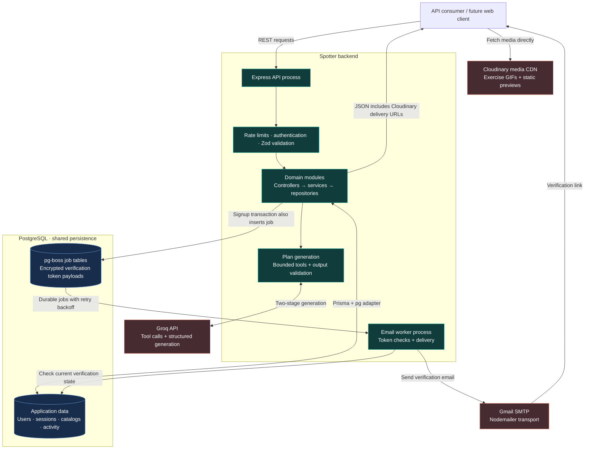
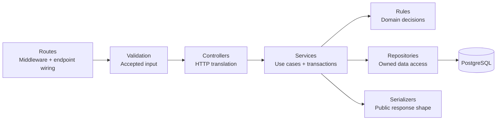

<p align="center">
  
</p>

<h1 align="center">Spotter</h1>
<p align="center"><strong>Personalized fitness. Thoughtful backend engineering.</strong></p>
<p align="center">An AI-assisted fitness backend connecting training, nutrition, and progress through secure sessions, transactional workflows, and background processing.</p>

<p align="center">
  
  
  
  
  
  
  
  <br />
  
  
  
  
  
  
</p>

<p align="center">
  <a href="#system-architecture">Architecture</a> ·
  <a href="#what-spotter-does">Features</a> ·
  <a href="#authentication-as-a-system">Authentication</a> ·
  <a href="#security-controls-and-owasp-guidance">Security</a> ·
  <a href="#repository-map">Repository</a> ·
  <a href="#run-locally">Run locally</a>
</p>

Spotter brings a user's goals, available equipment, food preferences, and activity history into one coherent backend. Its engineering focuses on the details that make these workflows dependable: ownership checks, database invariants, token lifecycles, asynchronous delivery, and validation of AI-generated content.

**Three places to start exploring the code:**

- **Transactional signup:** the account and its verification-email job commit together, eliminating the gap between saving a user and scheduling their email.
- **Session-aware authentication:** rotating refresh tokens, replay detection, and database-backed revocation keep authentication under server control.
- **Catalog-grounded AI:** the model requests bounded searches; the backend checks the returned plan against real records and recalculates nutrition itself.

## System architecture

Spotter is a **modular monolith with distributed runtime components**: an HTTP API, a separately launched email worker, PostgreSQL-backed job coordination, and external AI, email, and media services. Domain modules share one application and database; the worker has its own process and failure boundary.



The client node shows how consumers use the API; this repository currently contains the backend and a frontend specification. Cloudinary URLs are constructed by the API, while media is delivered directly to clients.

### Where the distributed-system decisions matter

| Boundary | Design decision | Why it matters |
| --- | --- | --- |
| API → job queue | `pg-boss` joins the Prisma signup transaction through `fromPrisma(tx)`. | The account and delivery intent either both exist or both roll back. |
| Queue → email worker | Persistent jobs, five retries, backoff, and a current-token check before sending. | Email can be processed outside the request; superseded verification jobs are skipped. |
| Worker → SMTP | Delivery happens after the database commit. | SMTP delays do not extend the signup transaction. External delivery can still repeat after a retry; it is not exactly-once email. |
| API → Groq | Provider adapter, request timeouts, bounded tool arguments, and layered response checks. | Provider failures and invalid model output become explicit application errors. |
| Client → media CDN | Store Cloudinary public IDs and serialize delivery URLs. | Exercise animations do not need to pass through the API server. |

See the [signup transaction](backend/src/modules/auth/auth.service.js), [queue configuration](backend/src/queues/queue.js), and [email worker](backend/src/workers/email.worker.js).

## What Spotter does

| Capability | Implemented behavior |
| --- | --- |
| Account access | Signup, email verification and resend, login, refresh-token rotation, logout, and logout-all. |
| Guided onboarding | Validated onboarding steps with saved progress and completion state. |
| Personalization | Separate account, public, body, health, nutrition, training, and coaching-preference models. |
| Goals and progress | Goal lifecycle rules, weight history, body measurements, and calculated fitness targets. |
| Nutrition tracking | Food and recipe catalogs, recipe nutrition calculations, meal logging, and quick entries. Meal items preserve nutrition snapshots. |
| Training tracking | Searchable exercise catalog, animated demonstrations, workout sessions, and exercise-specific tracking metrics. |
| Daily summaries | Meals, macros, calories, and workout activity aggregated using the user's local-day boundaries. |
| AI plan proposals | Readiness checks, template context, catalog searches, structured generation, and user-specific validation. |

**Current scope:** plan generation returns a validated proposal; saving and activating generated plans are future stages. AI conversation and audit-log models exist in the schema, but chat endpoints and automatic audit logging are not implemented. The daily-summary API calculates from source records; SQL triggers maintain existing summary-cache rows when installed.

## Authentication as a system

Authentication has an explicit lifecycle, from creating a verified identity to detecting reuse of an old credential.

1. **Create and verify.** Passwords are hashed with bcrypt at cost 12. Verification tokens contain 32 random bytes, expire after 24 hours, and are stored as SHA-256 hashes on the user record. The recoverable token needed for email is encrypted in the queue using AES-256-GCM and an HKDF-derived key.
2. **Establish a session.** Login creates a database session and a hashed opaque refresh token in one transaction. Access JWTs include the user, session, token ID, issuer, audience, and token type; verification pins the signing algorithm.
3. **Keep credentials short-lived.** Defaults are 15 minutes for access tokens, 7 days for refresh tokens, and a 30-day absolute session lifetime. Rotated refresh-token expiry is capped by the session expiry.
4. **Rotate atomically.** A conditional update consumes the old refresh token, inserts its replacement, links the chain, and updates session activity in one transaction. Competing requests cannot both consume the same token successfully.
5. **Handle races and replay deliberately.** Reuse within a five-second grace window returns a race error. Later reuse revokes the affected session and its refresh tokens. The grace window reduces accidental lockouts from concurrent browser requests while accepting a short replay-detection tradeoff.
6. **Enforce revocation on protected requests.** Middleware checks both JWT validity and the current database session, including ownership, expiry, revocation, and verified account status. Revocation therefore takes effect without waiting for the access JWT to expire.

```mermaid
sequenceDiagram
    autonumber
    participant C as Client
    participant A as Auth API
    participant D as PostgreSQL

    C->>A: POST /api/auth/refresh + HttpOnly cookie
    A->>D: Find token hash and session
    D-->>A: Token lifecycle + session state
    alt Token and session valid; token unused
        A->>D: Transaction: consume token, insert replacement, link chain
        D-->>A: Commit if conditional consume succeeds
        A-->>C: Access JWT + replacement refresh cookie
    else Recent reuse or concurrent consumption
        A-->>C: Refresh race error
    else Consumed token reused beyond grace window
        A->>D: Revoke affected session and its refresh tokens
        A-->>C: Reject refresh and clear cookie
    else Missing, expired, or revoked credential
        A-->>C: Reject refresh and clear cookie
    end
```

Refresh cookies use `HttpOnly`, `SameSite=Lax`, and `Secure` in production. Successful login and refresh responses use `Cache-Control: no-store`. Logout currently revokes the token's session; logout-all revokes all sessions for the identified user.

Explore the [auth service](backend/src/modules/auth/auth.service.js), [token implementation](backend/src/modules/auth/auth.tokens.js), [session middleware](backend/src/middlewares/auth.middleware.js), and [authentication contract tests](backend/test/auth.contract.test.js). Existing [request-sequence diagrams](Request%20Sequence/) document the individual flows.

## Security controls and OWASP guidance

The following maps **implemented controls** to relevant OWASP recommendations. It documents specific alignment, rather than claiming an OWASP certification or a complete security audit.

| Practice | Evidence in Spotter | OWASP reference |
| --- | --- | --- |
| Slow, salted password hashing | bcrypt cost 12; plaintext passwords are not persisted. | [Password Storage](https://cheatsheetseries.owasp.org/cheatsheets/Password_Storage_Cheat_Sheet.html) |
| Reduce account enumeration | Generic login failures, a dummy bcrypt comparison for unknown accounts, and uniform resend-verification responses. These reduce leakage; they do not guarantee identical timing. | [Authentication](https://cheatsheetseries.owasp.org/cheatsheets/Authentication_Cheat_Sheet.html) |
| Limit automated abuse | An API-wide IP limit plus tighter signup, login, verification, and resend limits. | [Authentication: automated attacks](https://cheatsheetseries.owasp.org/cheatsheets/Authentication_Cheat_Sheet.html#protect-against-automated-attacks) |
| Bound session lifetime and invalidate server-side | Session expiry, refresh rotation, replay response, database-backed revocation, and protected refresh cookies. | [Session Management](https://cheatsheetseries.owasp.org/cheatsheets/Session_Management_Cheat_Sheet.html) |
| Check ownership on data access | User-owned operations scope queries to the authenticated user; catalog access distinguishes shared records from private records. | [Authorization](https://cheatsheetseries.owasp.org/cheatsheets/Authorization_Cheat_Sheet.html) |

Additional protections include Zod request validation, action-specific profile fields, bounded JSON bodies, an explicit credentialed CORS allowlist, escaped usernames in verification emails, and generic public messages for unexpected server errors. Environment validation rejects invalid configuration and requires an HTTPS frontend URL in production.

**Hardening still matters.** OWASP prefers Argon2id for new password-storage designs; the current bcrypt implementation also needs byte-aware password limits, since its 72-character validation is not a 72-byte check. MFA, breached-password screening, and a fuller password policy remain future work. Rate limits currently use process-local storage, so multi-instance deployment needs a shared store and deliberate proxy configuration. Cookie-based endpoints need an explicit CSRF review; CORS is not a substitute for CSRF protection. TLS termination, secret management, and monitoring belong in the deployment design.

## Code architecture

The repository organizes code around business capabilities: auth, profiles, goals, nutrition, workouts, progress, and plans. Within each module, responsibilities are separated so changes have a predictable home.



### Decisions that make the code easier to evolve

- **Domain rules have a home.** Goal transitions, workout metrics, plan readiness, and nutrition calculations live alongside their modules, rather than being buried in route handlers.
- **Transactions follow business boundaries.** Signup and job creation, session creation, refresh rotation, and multi-record operations coordinate their writes explicitly.
- **Database constraints reinforce application rules.** Foreign keys, composite uniqueness, and partial unique indexes express invariants such as one active plan per user and one active/completed workout per scheduled occurrence. SQL supplements Prisma with BRIN, trigram, and GIN indexes.
- **Historical records preserve meaning.** Logged meal names and nutrients are snapshots, so later catalog edits do not rewrite what a user consumed. Planned workouts and completed activity have separate models.
- **External services sit behind adapters.** Groq transport and error translation are separate from tool execution and plan rules. Exercise serializers hide Cloudinary URL construction from clients.
- **Tests can exercise behavior in isolation.** Repository/database injection in services and focused rule modules support tests for ownership, validation, transitions, and calculations.

These choices make the code reviewable: a reader can trace a request from its accepted input to its authorization checks, business decision, database write, and public response.

### AI generation with backend authority

The [plan pipeline](backend/src/modules/plans/plan.generation.js) makes two provider requests: one to select catalog searches and one to generate structured content from the results. Tool execution is bound to the authenticated user. The backend validates tool names and arguments, limits response size, parses JSON, applies Zod, and then checks domain rules.

The [final rules](backend/src/modules/plans/plans-generation/plan-generated.rules.js) verify that selected IDs came from the retrieved catalog evidence, check schedule/equipment/metric compatibility, and recalculate nutrition from catalog portions. Model-provided calorie claims do not become the source of truth. These checks validate supported structural and domain constraints; they do not certify medical or allergy safety.

## Repository map

```text
Spotter/
├── README.md
├── backend/
│   ├── src/
│   │   ├── app.js                 # HTTP middleware, module routes, error boundary
│   │   ├── index.js               # Validate config, connect DB/queue, start API
│   │   ├── config/                # Environment and domain configuration
│   │   ├── lib/                   # Shared Prisma and Groq clients
│   │   ├── middlewares/           # Authentication, validation, limits, errors
│   │   ├── modules/               # Feature-oriented application code
│   │   │   ├── auth/              # Account, session, and token lifecycle
│   │   │   ├── users/             # Shared user repository
│   │   │   ├── on-boarding/        # Guided setup
│   │   │   ├── profiles/          # Personalization and target calculations
│   │   │   ├── goals/             # Goal lifecycle
│   │   │   ├── progress/          # Measurements and progress history
│   │   │   ├── foods/             # Food catalog
│   │   │   ├── recipes/           # Ingredients and calculated nutrition
│   │   │   ├── meals/             # Consumption logs and snapshots
│   │   │   ├── exercises/         # Exercise catalog and media serialization
│   │   │   ├── workouts/          # Workout sessions
│   │   │   ├── workout-exercises/ # Per-workout exercise tracking
│   │   │   ├── daily-summary/     # Local-day activity aggregation
│   │   │   └── plans/             # Readiness, AI orchestration, tools, rules
│   │   ├── providers/ai/          # Groq transport adapter
│   │   ├── queues/                # pg-boss setup and payload encryption
│   │   ├── workers/               # Separately launched email consumer
│   │   ├── emails/                # Email delivery service
│   │   ├── emails-temp/           # Email template and Spotter mascot
│   │   └── helpers/               # Session revocation and local-date utilities
│   ├── prisma/
│   │   ├── schema.prisma          # Relational model
│   │   ├── migrations/            # Versioned schema changes
│   │   ├── sql/                   # Supplemental indexes and summary triggers
│   │   ├── seed-data/             # Food, recipe, exercise, and template datasets
│   │   └── seed-*.js              # Catalog import scripts
│   ├── test/                     # Contract, route, service, and validation tests
│   ├── integration/              # Database-backed checks
│   ├── prisma.config.ts          # Prisma CLI configuration
│   ├── package.json              # Dependencies and runnable scripts
│   └── signup.rest               # Example HTTP requests
├── docs/
│   ├── *Module.md                # Domain documentation
│   ├── frontend/                 # Frontend specification
│   ├── technology-handbook/      # Technology-by-technology implementation notes
│   └── Spotter-Product-Vision.pdf # Product direction
└── Request Sequence/             # SVG authentication-flow diagrams
```

Generated Prisma files and local `outputs/` logs are development artifacts, rather than application modules.

### Technology responsibilities

| Layer | Technologies |
| --- | --- |
| Runtime and HTTP | JavaScript ES modules, Node.js, Express 5 |
| Persistence | PostgreSQL, Prisma 7, `@prisma/adapter-pg`, `pg` |
| Background work | `pg-boss`, Node `crypto`, Nodemailer |
| AI | Groq SDK, function tools, JSON Schema, Zod |
| Validation and access | Zod, `jsonwebtoken`, bcryptjs, `express-rate-limit`, `cors`, `cookie-parser` |
| Media | Cloudinary SDK and delivery URLs |
| Dates and imports | `date-fns`, `date-fns-tz`, CSV parsing utilities |
| Development | Node test runner, nodemon, dotenv, Prisma migrations and seed scripts |

The [technology handbook](docs/technology-handbook/README.md) explains how the individual tools are used.

## Run locally

Use **Node.js 22.12+ on the Node 22 line, or Node 24+**, npm, and PostgreSQL. The database setup needs permission to create the `pg_trgm` extension. The current email transport uses Gmail with an app password; Cloudinary and Groq configuration are also required by environment validation.

```sh
cd backend
npm install
```

Create a local, untracked `backend/.env` with the following settings. Supply your own credentials; do not commit this file.

| Variable | Value or purpose |
| --- | --- |
| `NODE_ENV` | `development` |
| `HOST`, `PORT` | `localhost`, `5050` (defaults) |
| `DATABASE_URL` | PostgreSQL connection URL for a local development database |
| `FRONTEND_URL` | Client origin, for example `http://localhost:5173` |
| `ACCESS_TOKEN_SECRET` | A randomly generated base64url secret containing at least 32 bytes |
| `ACCESS_TOKEN_EXPIRATION` | `15m` (default) |
| `REFRESH_TOKEN_EXPIRATION` | `7d` (default) |
| `SESSION_EXPIRATION` | `30d` (default) |
| `EMAIL_USER`, `EMAIL_APP_PASSWORD` | Gmail sender and app password |
| `CLOUD_NAME`, `CLOUD_API_KEY`, `CLOUD_API_SECRET` | Cloudinary configuration |
| `GROQ_API_KEY`, `GROQ_MODEL_NAME` | Groq credentials and a model supporting the adapter's tool-calling and structured-output options |

Generate the local secret with:

```sh
node -e "console.log(require('node:crypto').randomBytes(32).toString('base64url'))"
```

Prepare the database, then start the API:

```sh
npm run db:validate
npm run db:generate
npx prisma migrate deploy
npm run db:sql
npm run dev
```

Start the email worker in a second terminal, also from `backend/`:

```sh
npm run worker:email
```

Both processes must use the same database and access-token secret, because the worker derives its queue decryption key from that secret. The API defaults to `http://localhost:5050`; application routes are mounted under `/api`.

To populate the catalogs used by plan generation, run from `backend/`:

```sh
npm run seed:foods
npm run seed:recipes
npm run seed:exercises
npm run seed:plans
```

## Tests and further reading

```sh
# From backend/
npm test

# Database-backed suites: use a dedicated test database
npm run test:onboarding-db
npm run test:profiles-db
```

The test directory contains authentication contracts, protected-route checks, ownership and service behavior, input validation, rate limiting, and local-date handling. Database integration checks live separately in `backend/integration/`. The Groq provider smoke check is skipped by default; `node test/groq-manual.test.js --live` explicitly makes real provider calls and may incur usage charges.

For a deeper code review, start with the [authentication module](docs/AuthModule.md), [plan tools](docs/PlanTools.md), [database schema](backend/prisma/schema.prisma), and [frontend specification](docs/frontend/phase-0-frontend-spec.md). Product direction is documented in the [Spotter vision](docs/Spotter-Product-Vision.pdf).
