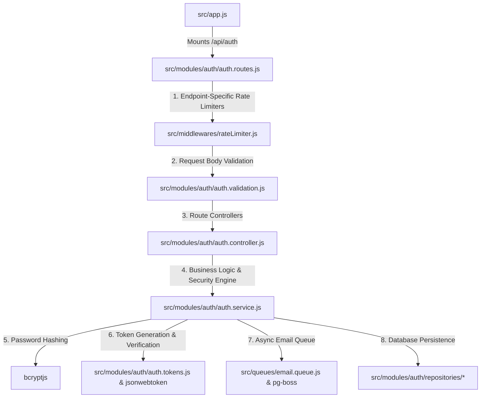
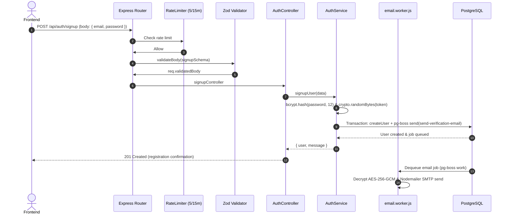
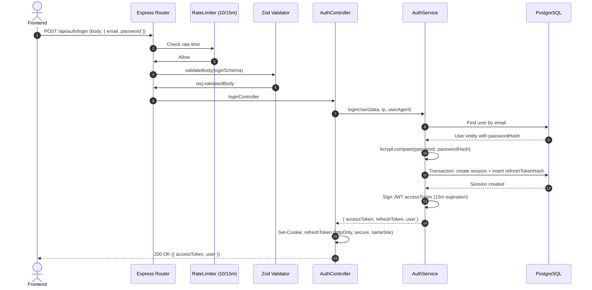
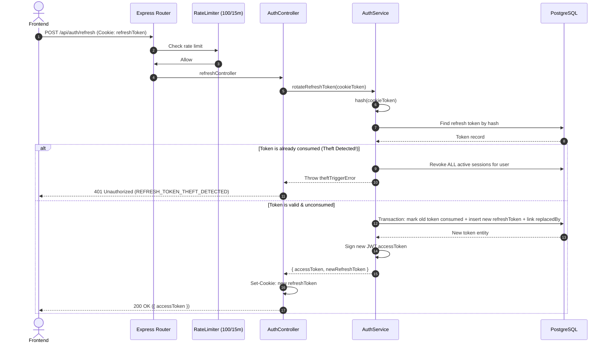
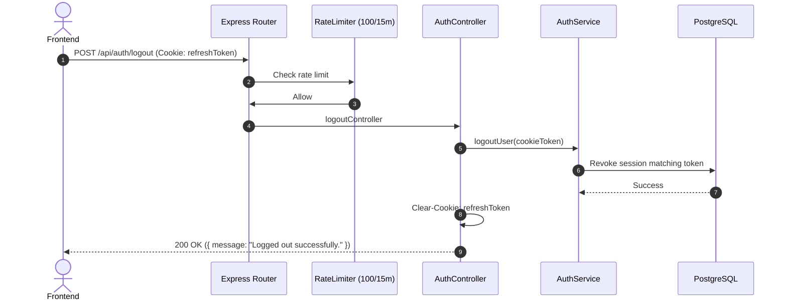

# Authentication Module - Complete Architecture & Flow

This document details the security model, session management, token lifecycles, and endpoint architecture of the **Authentication Module** (`/api/auth`).

---

## 1. High-Level File Integration

---

## 2. Endpoints Overview

| Method | Endpoint | Rate Limit | Purpose | Security Features |
| :--- | :--- | :--- | :--- | :--- |
| `POST` | `/api/auth/signup` | 5 / 15m | Register account | Password hashing (bcrypt 12 rounds), transactional email queue dispatch |
| `POST` | `/api/auth/verify-email` | 30 / 15m | Confirm email token | One-time token consumption, marks `emailVerifiedAt` |
| `POST` | `/api/auth/resend-verification` | 5 / 15m | Resend confirmation link | Cooldown protection, queue encryption |
| `POST` | `/api/auth/login` | 10 / 15m | Authenticate credentials | Timing-attack resistant dummy hash, issues access token + httpOnly refresh cookie |
| `POST` | `/api/auth/refresh` | 100 / 15m | Rotate refresh token | Single-use rotation, token reuse theft detection, revokes compromised session trees |
| `POST` | `/api/auth/logout` | 100 / 15m | Terminate active session | Clears `refreshToken` cookie, marks session revoked |
| `POST` | `/api/auth/logout-all` | 100 / 15m | Revoke all user sessions | Invalidate all session records across all devices |
| `GET` | `/api/auth/me` | Standard | Retrieve active user identity | Validates Bearer access token |

---

## 3. Core Security Mechanisms

### A. Refresh Token Rotation & Theft Detection
* Refresh tokens are stored in the database hashed via SHA-256 (`tokenHash`).
* When `/api/auth/refresh` is called:
  1. The existing token is marked `consumedAt: new Date()`.
  2. A new refresh token is generated and linked via `replacedByTokenId`.
  3. A new JWT access token is signed and returned.
* **Reuse Detection**: If a client attempts to use an already-consumed refresh token, the server identifies this as a potential token theft, immediately revokes **all** active sessions for that user, and returns `401 REFRESH_TOKEN_THEFT_DETECTED`.

### B. Anti-Timing Password Verification
To prevent email enumeration via timing side-channels, `login` runs a dummy `bcrypt.compare` against a precomputed static hash when an email is not found in the database.

### C. Background Job Queue (pg-boss + AES-256-GCM)
Verification emails are not sent synchronously during HTTP requests. Instead, an encrypted job payload is queued within the same PostgreSQL transaction that creates the user account, ensuring zero orphan accounts or dropped emails.

---

## 4. Request Sequences & Execution Flows

### A. `POST /api/auth/signup` (Register Account)

### B. `POST /api/auth/login` (User Login & Token Issuance)

### C. `POST /api/auth/refresh` (Token Rotation & Theft Detection)

### D. `POST /api/auth/logout` (Revoke Session)

