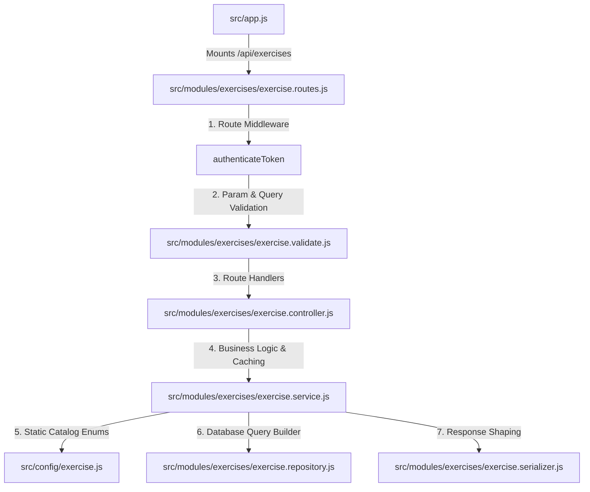
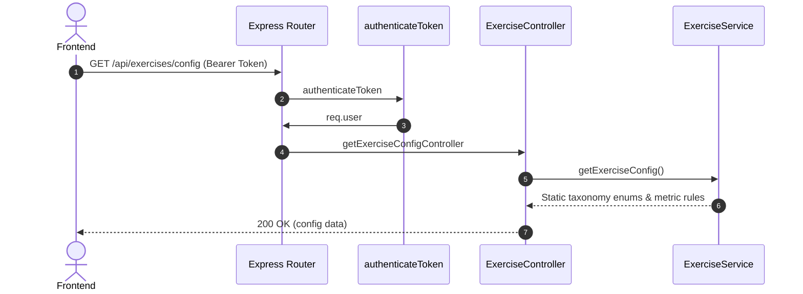
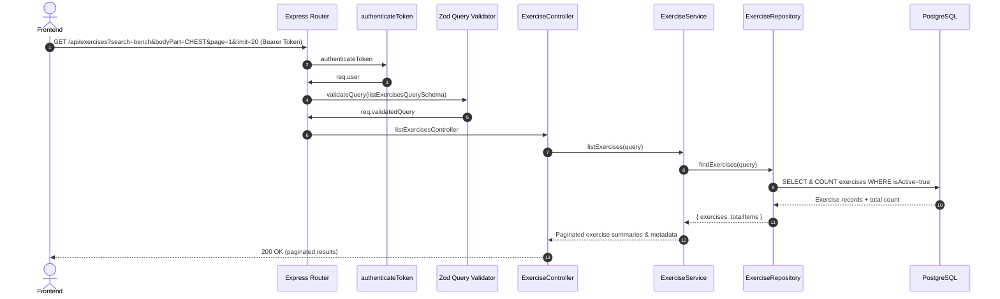
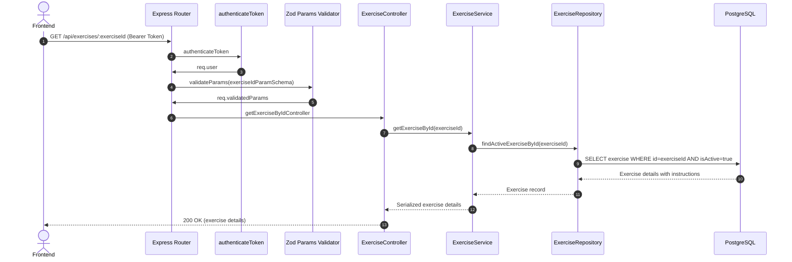

# Exercises Module - Complete Architecture & Flow

This document details the architecture, taxonomy, catalog indexing, search capabilities, and endpoint structure of the **Exercises Module** (`/api/exercises`).

---

## 1. High-Level File Integration



---

## 2. Endpoints Overview

| Method | Endpoint | Purpose | Validation | Cache Policy |
| :--- | :--- | :--- | :--- | :--- |
| `GET` | `/api/exercises/config` | Retrieve enum values, body parts, equipment, tracking metrics | None | `no-store` |
| `GET` | `/api/exercises` | Search and filter catalog with pagination | `listExercisesQuerySchema` | `no-store` |
| `GET` | `/api/exercises/:exerciseId` | Fetch detailed instructions and metadata for one exercise | `exerciseIdParamSchema` | `no-store` |

---

## 3. Data Model & Taxonomy

The exercise catalog is a curated, system-managed database table (`exercises`) with strict taxonomy:

### A. Core Attributes
* **`exerciseType`**: `WEIGHT_REPS`, `BODYWEIGHT_REPS`, `WEIGHT_DISTANCE`, `DISTANCE_TIME`, `REPS_TIME`, `TIME_ONLY`
* **`bodyPart`**: `CHEST`, `BACK`, `SHOULDERS`, `UPPER_ARMS`, `FOREARMS`, `UPPER_LEGS`, `LOWER_LEGS`, `WAIST`, `CARDIO`, `NECK`
* **`difficulty`**: `BEGINNER`, `INTERMEDIATE`, `EXPERT`
* **`equipment`**: `BARBELL`, `DUMBBELL`, `CABLE`, `MACHINE`, `BODY_WEIGHT`, `KETTLEBELL`, `BAND`, `SMITH_MACHINE`, etc.
* **`trackingMetrics`**: Array of measurement columns that workouts must track for this exercise (e.g. `["SETS", "REPS", "WEIGHT_KG"]`).
* **`gifPublicId`**: Cloudinary public ID for animated exercise demonstrations.

---

## 4. Query & Filter Architecture

The repository dynamically constructs Prisma search conditions combining text matching and faceted filters:

```javascript
// Case-insensitive name or slug search:
if (search) {
  where.OR = [
    { name: { contains: search, mode: "insensitive" } },
    { slug: { contains: search, mode: "insensitive" } },
  ];
}
// Faceted taxonomy filters (combined via AND):
if (bodyPart) where.bodyPart = bodyPart;
if (difficulty) where.difficulty = difficulty;
if (equipment) where.equipment = equipment;
```

---

## 5. Serializer Contract

* **`serializeExerciseSummary`**: Returns lightweight catalog metadata optimized for search dropdowns and lists (`id`, `name`, `slug`, `bodyPart`, `equipment`, `trackingMetrics`, `gifPublicId`).
* **`serializeExerciseDetails`**: Includes full step-by-step instructions (`instructions: string[]`).

---

## 6. Request Sequences & Execution Flows

### A. `GET /api/exercises/config` (Get Exercise Taxonomy Enums)



### B. `GET /api/exercises` (Search & Filter Catalog)



### C. `GET /api/exercises/:exerciseId` (Exercise Details)



