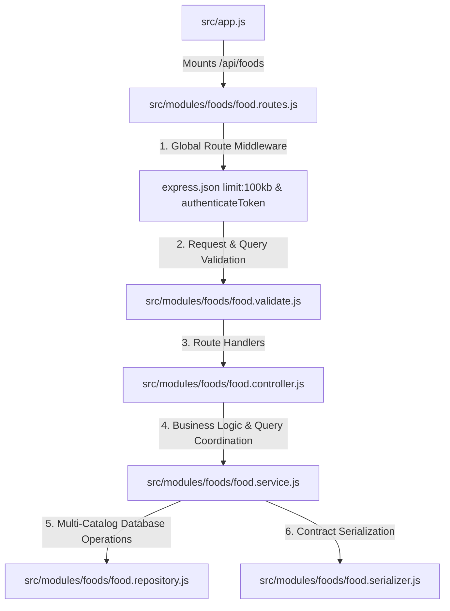

# Foods Module - Complete Architecture & Flow

This document details the architecture, catalog structure, validation rules, and endpoint specifications of the **Foods Module** (`/api/foods`).

---

## 1. High-Level File Integration



---

## 2. Endpoints Overview

| Method | Endpoint | Purpose | Validation | Expected Response |
| :--- | :--- | :--- | :--- | :--- |
| `GET` | `/api/foods` | Overview of recently logged foods and user's custom foods | Authenticated | `{ recentFoods: [...], customFoods: [...] }` |
| `GET` | `/api/foods/search` | Search active catalog and custom foods | `getFoodsQuerySchema` (`search`, `category`, `page`, `limit`) | Paginated food items with page metadata |
| `POST` | `/api/foods/custom` | Create a user-owned custom food item | `createCustomFoodSchema` | 201 with created food and normalized 100g macros |

---

## 3. Why Foods Are Structured Like That

### A. The 100-Gram Normalized Baseline
- **The Rationale:** Every food in Spotter—whether imported from the USDA database, the Egyptian national food dataset, or created by a user—defines its macronutrients strictly **per 100 grams**:
  - `caloriesPer100g`
  - `proteinGramsPer100g`
  - `carbohydrateGramsPer100g`
  - `fatGramsPer100g`
- **Why this matters:**
  - Standardizing on 100g eliminates unit confusion.
  - Scaling in recipes and meals becomes a trivial, uniform multiplication: $\text{factor} = \frac{\text{grams}}{100}$.
  - Custom foods cannot submit arbitrary portion macros without a corresponding gram definition.

### B. Dual Catalog Architecture
1. **Global Catalog Foods (`createdByUserId == null`):**
   - Seeded from verified CSV datasets via `prisma/seed-food.js`.
   - Immutable to regular users.
   - Accessible by all authenticated users during search and logging.
2. **User Custom Foods (`createdByUserId == userId`):**
   - Created via `POST /api/foods/custom`.
   - Strictly scoped: Only visible to and loggable by the user who created them.
   - Protects users from spam or inaccurate user-generated entries submitted by other accounts.

### C. Overview Caching & Recent Foods
- `GET /api/foods` provides an instant dashboard of frequently used items without forcing the user to type search queries on every meal entry.
- Recent foods are derived from the user's latest `MealItem` entries, providing a personalized quick-access list.

---

## 4. Core Business Rules & Invariants

1. **Macronutrient Bounds Validation:**
   - Macronutrients are constrained by physical laws:
     - `caloriesPer100g`: Max 1000 kcal (pure dietary fat is ~900 kcal/100g; values > 1000 indicate bad data).
     - `proteinGramsPer100g`, `carbohydrateGramsPer100g`, `fatGramsPer100g`: Must be between 0 and 100g.
2. **Search Visibility Filter:**
   - In `foodRepository.searchFoods`, the Prisma query enforces:
     ```prisma
     where: {
       isActive: true,
       OR: [
         { createdByUserId: null },     // Global catalog
         { createdByUserId: userId }     // User's own custom foods
       ],
       // ... text search and category filter
     }
     ```
3. **Archived / Inactive Foods:**
   - Global or custom foods marked `isActive: false` or with non-null `archivedAt` are automatically excluded from search and overview results.

---

## 5. Layer Responsibilities

- **`food.routes.js`:** Authenticated router mounting GET overview, GET search, and POST custom food.
- **`food.validate.js`:** Enforces numeric types, non-empty names, optional Arabic translations (`nameAr`), and macro range limits.
- **`food.controller.js`:** Dispatches requests, sets status codes (`200 OK`, `201 Created`).
- **`food.service.js`:** Orchestrates parallel fetches for the overview and computes pagination metadata (`totalPages`, `hasNextPage`, `hasPreviousPage`).
- **`food.repository.js`:** Handles text search, category filtering, and Prisma pagination (`take`, `skip`).
- **`food.serializer.js`:** Injects the `isCustom` flag (`createdByUserId === userId`) and serializes Prisma Decimal fields to floats.

---

## 6. How Edge Cases Are Handled

1. **Empty Search Queries:**
   - If `search` is omitted in `GET /api/foods/search`, the repository returns all visible catalog foods ordered by name, supporting category browsing.
2. **Pagination Overflow:**
   - Requesting `page: 999` when only 5 pages exist gracefully returns an empty array `items: []` with `hasNextPage: false` rather than erroring.
3. **Preventing Name Collision Bugs:**
   - Users can name a custom food "Banana" without conflicting with the global catalog "Banana", because custom foods are differentiated by `id` and `createdByUserId`.
