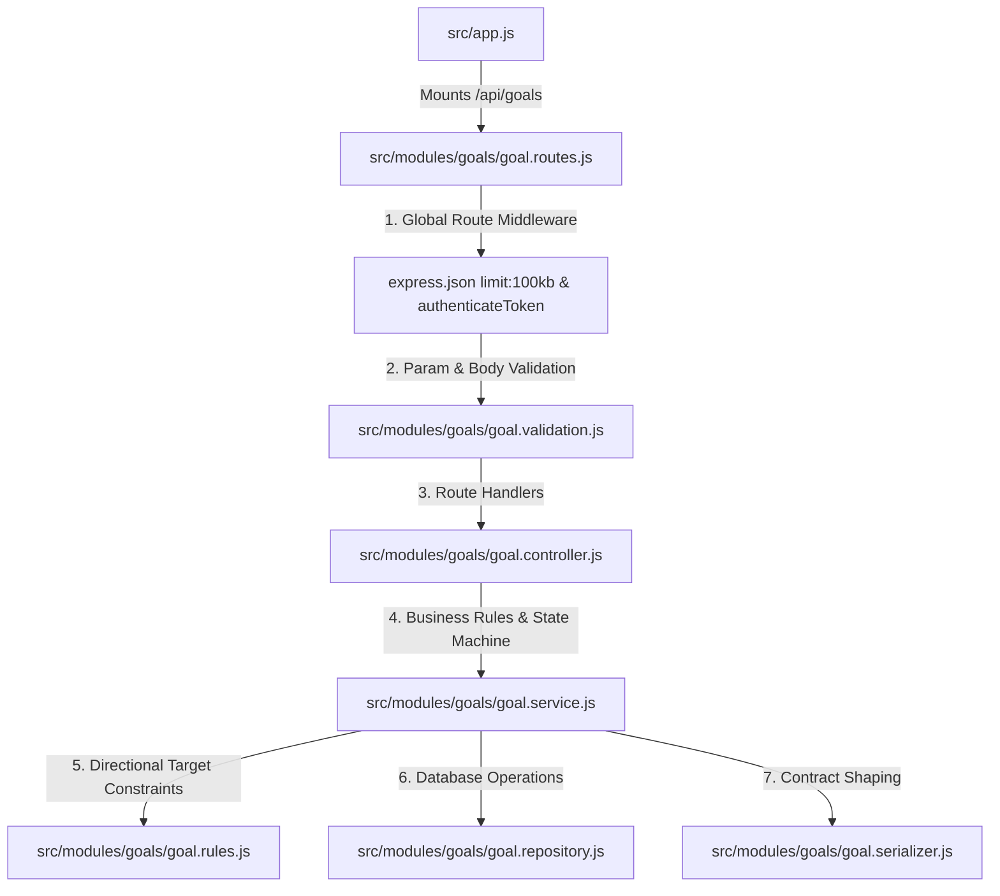

# Goals Module - Complete Architecture & Flow

This document details the architecture, state machine lifecycle, business rules, and endpoint structure of the **Goals Module** (`/api/goals`).

---

## 1. High-Level File Integration



---

## 2. Endpoints Overview

| Method | Endpoint | State Allowed | Purpose | Validation |
| :--- | :--- | :--- | :--- | :--- |
| `POST` | `/api/goals` | N/A | Create an editable `DRAFT` goal | `createGoalSchema` |
| `POST` | `/api/goals/:goalId/activate` | `DRAFT` | Activate draft (must be only active goal) | `goalIdParamSchema` |
| `GET` | `/api/goals` | All | List all historical goals for user | None |
| `GET` | `/api/goals/active` | `ACTIVE` | Retrieve currently active goal + progress delta | None |
| `GET` | `/api/goals/:goalId` | All | Fetch specific goal details | `goalIdParamSchema` |
| `PATCH` | `/api/goals/:goalId` | `DRAFT` only | Update fields (type, target weight, target date) | `goalIdParamSchema` + `updateGoalSchema` |
| `POST` | `/api/goals/:goalId/complete`| `ACTIVE` only| Mark active goal as successfully completed | `goalIdParamSchema` |
| `POST` | `/api/goals/:goalId/cancel` | `DRAFT` or `ACTIVE` | Abandon draft or prematurely terminate goal | `goalIdParamSchema` |

---

## 3. Why Are Goals Structured Like That?

### A. The Goal State Machine Lifecycle
Goals follow an explicit, one-way state machine:

```text
       ┌──────────┐
       │  DRAFT   │
       └────┬─────┘
            │
      activateGoal()
            │
            ▼
       ┌──────────┐
       │  ACTIVE  │
       └────┬─────┘
            │
      ┌─────┴──────────────┐
      ▼                    ▼
┌───────────┐        ┌───────────┐
│ COMPLETED │        │ CANCELLED │
└───────────┘        └───────────┘
```

1. **`DRAFT`:** Editable. A user can explore different target weights, dates, or goal types without impacting their active plan.
2. **`ACTIVE`:** Read-only execution phase. A user can only have **one** active goal at a time. Active goals drive daily calorie and macro target calculations.
3. **`COMPLETED`:** Terminal state reached when the user fulfills their milestone.
4. **`CANCELLED`:** Terminal state reached when a draft is discarded or an active goal is abandoned.

### B. Why Creation (`POST /`) and Activation (`POST /:id/activate`) Are Separated
- If creating a goal automatically activated it, a user currently working on an active 12-week cut could not plan their upcoming maintenance phase in advance without prematurely ending their current goal.
- Separation allows the frontend to support "Draft Next Goal" workflows. The user drafts the goal, reviews target calculations, and activates it only when ready.

### C. Immutability of Active Goals
- **Active goals cannot be edited (`PATCH` is rejected on non-drafts).**
- **Rationale:** If an active goal could silently mutate from `LOSE_WEIGHT` to `GAIN_WEIGHT` midway through a cycle, historical progress analytics, target timelines, and adherence metrics would become corrupt and untraceable.
- If a user wishes to pivot, they must **cancel** the active goal (or complete it) and activate a new draft.

### D. Why Goals Cannot Be Deleted
- There is **no `DELETE /api/goals/:id` endpoint**.
- Spotter preserves a complete chronological history of every fitness cycle a user attempts. Completed and cancelled goals remain in the database for longitudinal analytics and AI coach context.

---

## 4. Core Business Rules & Invariants

1. **Singular Active Goal Constraint:**
   - A user may have multiple `DRAFT`, `COMPLETED`, or `CANCELLED` goals, but **at most ONE `ACTIVE` goal**.
   - Attempting to activate a draft when another goal is already active throws `ActiveGoalExistsError` (HTTP 409).
2. **Strict Weight Directionality Rules (`goal.rules.js`):**
   - Targets are validated against the user's latest recorded weight check-in (`ProgressEntry`):
     - **`LOSE_WEIGHT`:** `targetWeightKg` must be strictly **lower** than current weight.
     - **`GAIN_WEIGHT`:** `targetWeightKg` must be strictly **higher** than current weight.
     - **`MAINTAIN_WEIGHT`:** `targetWeightKg` must be **omitted / null**. Setting a target weight on a maintenance goal throws `InvalidGoalStateError`.
3. **Stale Draft Revalidation on Activation:**
   - A user might create a draft goal to lose weight from 85 kg to 80 kg. Three weeks later, their weight drops to 79 kg due to illness before they activate the draft.
   - When `activateGoal` is called, the service re-reads the latest weight from `ProgressEntry` and re-runs `assertGoalTargetDirection`. Stale or logically impossible goals are caught before activation.
4. **Target Date Constraints:**
   - Target dates must be in the future (validated by `zod` date schemas).
5. **Coupled Goal Type & Target Weight Edits:**
   - In `updateGoal`, if a user switches a goal from `LOSE_WEIGHT` to `MAINTAIN_WEIGHT`, the API prevents contradictory states where a maintenance goal holds an orphaned target weight.

---

## 5. Detailed Function & Layer Responsibilities

```text
src/modules/goals/
├── goal.routes.js       # Route registration, param parsing, middleware chaining
├── goal.validation.js   # Zod validation for creation, update, and UUID parameters
├── goal.controller.js   # HTTP unwrapping, Cache-Control: no-store
├── goal.service.js      # State transitions, activation locks, staleness checks
├── goal.rules.js        # Pure business functions (directional math)
├── goal.repository.js   # Prisma database operations (CRUD, status transitions)
└── goal.serializer.js   # Contract serialization, Decimal to float conversions
```

- **`goal.rules.js`:** Pure utility functions containing zero database dependencies. Easily testable unit logic ensuring target directions match goal types.
- **`goal.service.js`:** Orchestrates checks across `progressRepository` and `goalRepository`. Enforces that completion only operates on `ACTIVE` goals and cancellation operates on `DRAFT` or `ACTIVE` goals.
- **`goal.serializer.js`:** When returning the active goal (`getActiveGoal`), it injects computed progress deltas (e.g., initial weight vs current weight vs target weight remaining).

---

## 6. How Edge Cases Are Handled

1. **Creating Weight Goals Without Recorded Weight:**
   - If a new user attempts to create a `LOSE_WEIGHT` goal before any weight is logged, the service throws `ProfileIncompleteError` ("Record your current weight before setting a weight goal.").
2. **Premature Completion:**
   - Calling `POST /:goalId/complete` on a `DRAFT` goal throws `InvalidGoalStateError` ("Only an active goal can be completed.").
3. **Double Cancellation:**
   - Calling `POST /:goalId/cancel` on an already cancelled or completed goal throws `InvalidGoalStateError` ("Only a draft or active goal can be cancelled.").
4. **Missing Goals:**
   - Querying or mutating a non-existent goal (or a goal owned by another user) throws `GoalNotFoundError` (HTTP 404).
