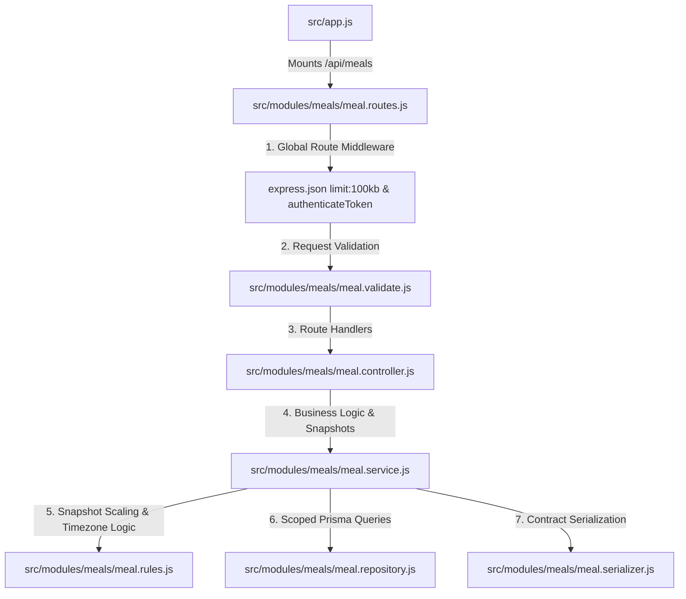

# Meals Module - Complete Architecture & Flow

This document details the architecture, request pipelines, snapshot data integrity rules, and endpoint specifications of the **Meals Module** (`/api/meals`).

---

## 1. High-Level File Integration



---

## 2. Endpoints Overview

| Method | Endpoint | Purpose | Validation | Expected Response |
| :--- | :--- | :--- | :--- | :--- |
| `GET` | `/api/meals` | List meals for authenticated user | `listMealsQuerySchema` (`date`, `page`, `limit`) | Paginated list of meals + pagination metadata |
| `GET` | `/api/meals/:mealId` | Retrieve single meal with all constituent items | `mealIdParamSchema` (UUID) | 200 with complete meal details and item snapshots |
| `POST` | `/api/meals` | Log a meal (composed of foods, recipes, or quick logs) | `createMealSchema` | 201 Created with meal and computed item snapshots |
| `PUT` | `/api/meals/:mealId` | Replace a meal's details and recalculate its items | `mealIdParamSchema` + `replaceMealSchema` | 200 OK with replaced meal and new snapshots |
| `DELETE` | `/api/meals/:mealId` | Delete a logged meal | `mealIdParamSchema` | 204 No Content |

---

## 3. Why The Meals Module Is Structured Like That

### A. The "Snapshot" Architecture (Immutable Point-in-Time History)
- **The Problem:** In conventional CRUD systems, a meal item record often stores relational pointers:
  ```json
  { "mealId": "uuid", "foodId": "uuid", "quantityGrams": 200 }
  ```
  If the user later edits the protein or calorie density of that custom food (or if a catalog item is updated), **every single past meal ever logged with that food retroactively changes its nutritional values**. Historical daily summaries, compliance records, and AI coaching data become corrupted.
- **The Solution:** When a meal is created or replaced, `meal.service.js` queries the referenced foods and recipes, calculates their exact scaled macros, and writes an **immutable snapshot directly into the `MealItem` row**:
  - `itemName` (frozen string, e.g. "Grilled Chicken Breast")
  - `calories`
  - `proteinGrams`
  - `carbohydrateGrams`
  - `fatGrams`
- **Result:** Even if the underlying custom food is deleted or the recipe is archived, past meal logs remain 100% stable, accurate, and independent.

### B. Discriminated Union for Meal Items (Foods, Recipes, Quick Add)
- Meals support three distinct logging workflows via `z.discriminatedUnion("itemType", ...)`:
  1. **`FOOD`:** `{ itemType: "FOOD", foodId, quantityGrams }` (scales per 100g).
  2. **`RECIPE`:** `{ itemType: "RECIPE", recipeId, servings }` (scales per serving).
  3. **`QUICK`:** `{ itemType: "QUICK", itemName, calories, proteinGrams?, carbohydrateGrams?, fatGrams? }` (direct manual entry without needing a database food item).
- Discriminating on `itemType` ensures zero schema leakage (e.g., you cannot send `servings` with a `FOOD` item, and you cannot send `quantityGrams` with a `QUICK` item).

### C. Hard Deletes for Meals vs Soft Deletes for Recipes
- Unlike recipes (which are soft-deleted/archived because other meals might reference them), logged meals are **personal temporal events**.
- Deleting a meal via `DELETE /api/meals/:mealId` permanently removes the meal and its dependent `MealItem` rows via database cascade.

---

## 4. Core Business Rules & Invariants

1. **Future Clock Tolerance:**
   - Logging meals in the future is prohibited to preserve realistic tracking.
   - To account for device clock drift or slight network lag, `assertMealTimeIsNotFuture` allows a **5-minute grace tolerance** (`FUTURE_CLOCK_TOLERANCE_MS = 5 * 60 * 1000`). Timestamps beyond this threshold throw `InvalidMealTimeError` (HTTP 400).
2. **Item Ownership & Visibility Checks:**
   - In `prepareMealItems`, the repository verifies that every referenced `foodId` and `recipeId` is accessible to the calling user:
     - Global catalog items (`createdByUserId == null`).
     - User's own custom items (`createdByUserId == userId`).
   - If any ID belongs to another user or does not exist, the transaction aborts with `InvalidMealItemsError`.
3. **Timezone-Aware Date Querying:**
   - When a client queries meals by date (`GET /api/meals?date=2026-09-03`), the server extracts the user's timezone from their account preferences (or request context).
   - `buildMealDateRange` uses `Intl.DateTimeFormat` to calculate the exact UTC timestamps corresponding to local midnight and the following midnight. This ensures meals logged late at night (e.g., 11:30 PM) are attributed to the correct local calendar day.
4. **Meal Type Enum:**
   - `mealType` must be one of: `BREAKFAST`, `LUNCH`, `DINNER`, `SNACK`.

---

## 5. Layer Responsibilities & Implementation Details

- **`meal.routes.js`:** Mounts `authenticateToken`, sets `express.json({ limit: "100kb" })`, and links routes to controllers.
- **`meal.validate.js`:** Validates pagination bounds, UUID params, `occurredAt` timestamps, and parses the discriminated union for meal items.
- **`meal.controller.js`:** Attaches `Cache-Control: no-store` on private meal responses and passes clean data to the service.
- **`meal.service.js`:** Enforces the future clock check, batches food and recipe reads, builds snapshot data, and wraps meal updates in atomic transactions.
- **`meal.rules.js`:** Contains pure calculation functions:
  - `buildMealItemSnapshots`: Iterates through items, scales macros using Prisma Decimal arithmetic to 2 decimal places, and produces snapshot records.
  - `buildMealDateRange`: Calculates timezone-aware UTC boundary pairs.
- **`meal.repository.js`:** Executes scoped Prisma queries ensuring users can only read, update, or delete meals they own (`userId === req.user.id`).

---

## 6. How Edge Cases Are Handled

1. **Future-Dated Requests:**
   - If a client posts a meal timestamp 10 minutes in the future, the request immediately fails with `400 Bad Request` (`INVALID_MEAL_TIME`).
2. **Batch Accessibility Mismatch:**
   - If a payload contains 3 foods, but only 2 exist in the database or belong to the user, `prepareMealItems` detects `foods.length !== foodIds.length` and throws `InvalidMealItemsError` (HTTP 400).
3. **Partial Replacement Failures:**
   - During `PUT /api/meals/:mealId`, replacing meal items and updating header fields occurs inside a single database transaction. If snapshot insertion fails, previous items are not lost.
4. **Accessing Another User's Meal:**
   - `findOwnedMealById` filters strictly on `userId`. Attempting to read, replace, or delete someone else's meal returns `MealNotFoundError` (HTTP 404), preventing resource existence enumeration.
