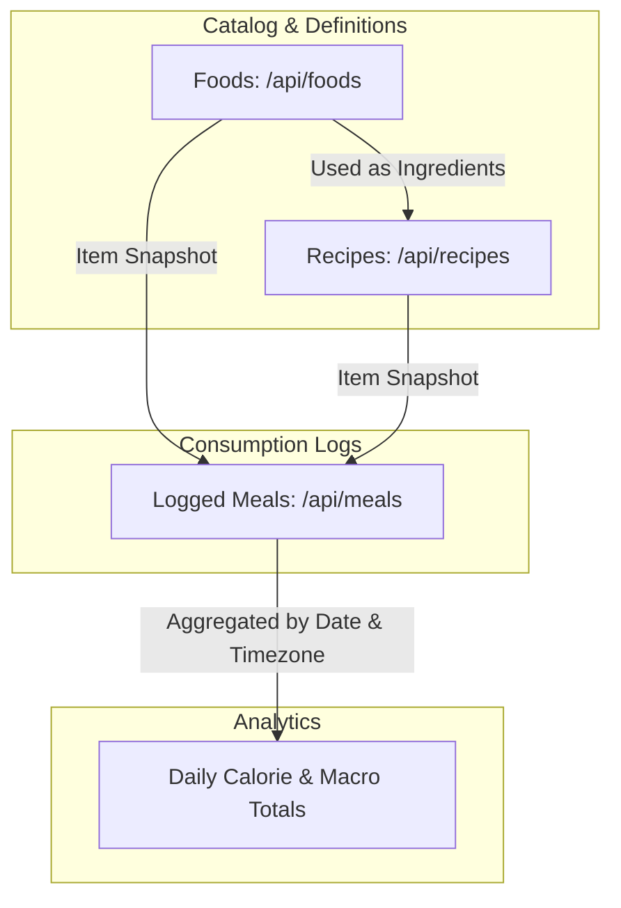

# Nutrition Module (Foods, Recipes & Meals) - Complete Architecture & Flow

This document details the architecture, endpoint breakdown, business rules, and snapshot design of the **Nutrition Stack** (`/api/foods`, `/api/recipes`, and `/api/meals`).

---

## 1. High-Level File Integration & Domain Relationship

The nutrition system uses a three-tier hierarchy that guarantees historical audit accuracy:



---

## 2. Endpoints Overview

### A. Foods (`/api/foods`)
| Method | Endpoint | Purpose | Validation |
| :--- | :--- | :--- | :--- |
| `GET` | `/api/foods` | Returns recent foods and user's custom foods | Authenticated |
| `GET` | `/api/foods/search` | Search foods by name or category with pagination | `getFoodsQuerySchema` |
| `POST` | `/api/foods/custom` | Create a user-owned custom food item | `createCustomFoodSchema` |

### B. Recipes (`/api/recipes`)
| Method | Endpoint | Purpose | Validation |
| :--- | :--- | :--- | :--- |
| `GET` | `/api/recipes` | Returns recent and user-created custom recipes | Authenticated |
| `GET` | `/api/recipes/search` | Search recipes by name or cuisine | `searchRecipesQuerySchema` |
| `GET` | `/api/recipes/:recipeId` | Retrieve full recipe with ingredient breakdown | `recipeIdParamSchema` |
| `POST` | `/api/recipes` | Create recipe from ingredients with auto-calculated macros | `createRecipeSchema` |
| `PUT` | `/api/recipes/:recipeId` | Replace ingredients and recalculate nutrition | `replaceRecipeSchema` |
| `DELETE` | `/api/recipes/:recipeId` | Soft-delete (archive) owned recipe | `deleteRecipeSchema` + confirmation |

### C. Meals (`/api/meals`)
| Method | Endpoint | Purpose | Validation |
| :--- | :--- | :--- | :--- |
| `GET` | `/api/meals` | List meals (supports `date` filter & pagination) | `listMealsQuerySchema` |
| `GET` | `/api/meals/:mealId` | Get meal details with all logged items | `mealIdParamSchema` |
| `POST` | `/api/meals` | Log a meal composed of food and/or recipe items | `createMealSchema` |
| `PUT` | `/api/meals/:mealId` | Replace an entire meal and recalculate snapshots | `replaceMealSchema` |
| `DELETE` | `/api/meals/:mealId` | Delete a logged meal | `mealIdParamSchema` |

---

## 3. Why The Nutrition System Is Separated Like That

### A. The "Snapshot" Architecture (Immutable Point-in-Time History)
- **The Problem:** In naive systems, a meal log stores references: `{ mealId, foodId, quantityGrams }`. If the user later edits their custom protein bar recipe from 250 kcal to 200 kcal, **all past meals retroactively change their calories**, ruining historical tracking, weekly charts, and AI coach analysis.
- **The Spotter Solution:** When a meal is created or replaced, `meal.service.js` fetches the current nutrition data and immediately writes an **immutable snapshot** into `MealItem`:
  - `calories`
  - `proteinGrams`
  - `carbohydrateGrams`
  - `fatGrams`
- **Result:** If a custom recipe or food is modified or deleted next month, historical meal entries remain 100% stable and accurate.

### B. Foods vs Recipes Separation
- **Foods** are atomic entities defined by nutrition per 100g (e.g., raw chicken breast, white rice).
- **Recipes** are composite entities constructed from multiple food items. They require:
  1. Ingredient aggregation.
  2. Yield calculations (`totalYieldGrams`).
  3. Portioning (`servings`).
  4. Per-serving macro division.
- Keeping them separate prevents code duplication and gives users a natural distinction between basic ingredients and batch-cooked meals.

### C. Soft Deletion (Archiving) for Recipes
- Deleting a recipe (`DELETE /api/recipes/:id`) **never deletes rows from the database**.
- It sets `archivedAt = new Date()` and `isActive = false`.
- **Reason:** Even though meals snapshot macros, keeping the recipe entity intact preserves relational integrity and auditability in historical summaries.

---

## 4. Core Business Rules & Invariants

1. **Future Clock Tolerance:**
   - Users cannot log meals in the future.
   - To accommodate small device clock drift, `assertMealTimeIsNotFuture` enforces a **5-minute grace tolerance** (`FUTURE_CLOCK_TOLERANCE_MS = 5 * 60 * 1000`). Timestamps further ahead throw `InvalidMealTimeError` (HTTP 400).
2. **Access Control & Visibility Scoping:**
   - When searching or preparing items:
     - Global items (`createdByUserId == null`, imported from CSV seeds) are visible to all users.
     - Custom items (`createdByUserId == userId`) are private and visible only to the creator.
   - Users cannot access or log another user's custom foods or private recipes.
3. **Automated Recipe Nutrition Calculation (`recipe.rules.js`):**
   - The user supplies raw ingredients and desired servings.
   - The backend validates that all ingredient foods exist and calculates:
     $$\text{Total Cal} = \sum \left( \frac{\text{calPer100g}}{100} \times \text{ingredientGrams} \right)$$
     $$\text{Cal Per Serving} = \frac{\text{Total Cal}}{\text{servings}}$$
   - Clients never supply calculated macros directly; the server remains the authoritative source of nutritional truth.
4. **Timezone-Aware Meal Filtering:**
   - Querying meals by date (`GET /api/meals?date=2026-09-03`) converts the calendar day into a UTC date range based on the user's current timezone. This prevents meals logged at 11:00 PM from slipping into the following day.

---

## 5. Layer Responsibilities

```text
src/modules/meals/
├── meal.routes.js       # JSON parsing, auth guard, validation schemas
├── meal.validate.js     # Validates occurredAt date, mealType enum, items array
├── meal.controller.js   # HTTP unwrapping, status codes
├── meal.service.js      # Future-time validation, snapshot preparation, transaction flow
├── meal.rules.js        # Pure snapshot builders and timezone date ranges
├── meal.repository.js   # Scoped Prisma queries (accessible items, meal replacements)
└── meal.serializer.js   # Contract shaping
```

---

## 6. How Edge Cases Are Handled

1. **Inaccessible or Deleted Ingredients in Recipe Creation:**
   - If an ingredient `foodId` does not exist or belongs to another user, `findAccessibleIngredientFoods` detects the count mismatch and throws `InvalidRecipeIngredientsError`.
2. **Static Route Precedence:**
   - In `recipe.routes.js`, the static search route `/search` is registered **before** `/:recipeId`. This ensures the string `"search"` is never erroneously captured as a UUID param.
3. **Replacing Meals:**
   - `PUT /api/meals/:mealId` uses database transactions to atomicly replace all `MealItem` snapshot rows while preserving the parent `Meal` record's creation metadata.
