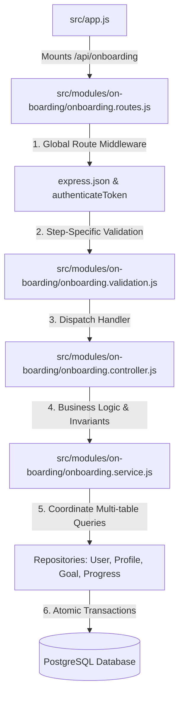

# Onboarding Module - Complete Architecture & Flow

This document provides an in-depth breakdown of how the **Onboarding Module** (`/api/onboarding`) is constructed, why its endpoints and steps are separated, its underlying business rules, and how edge cases and transactions are handled.

---

## 1. High-Level File Integration

When an onboarding request hits the backend, it flows through our layered architecture:



---

## 2. Endpoints Overview

| Method | Endpoint | Purpose | Request Body / Params | Expected Response |
| :--- | :--- | :--- | :--- | :--- |
| `GET` | `/api/onboarding/config` | Returns static options and constraints for frontend forms | None | Enums (`goalTypes`, `activityLevels`, `unitSystems`), age limits, height/weight bounds |
| `GET` | `/api/onboarding` | Returns the current user's onboarding step and pre-filled data | None | `{ status, currentStep, completedSteps, data: { ... } }` |
| `PATCH` | `/api/onboarding` | Saves draft progress for Step 1 or Step 2 | `{ step: 1 \| 2, data: { ... } }` | `{ status, currentStep, completedSteps, message }` |
| `POST` | `/api/onboarding/complete` | Validates all saved steps, activates goal, creates initial progress, and seals onboarding | None | `{ status: "completed", currentStep: null, completedSteps: [1, 2, 3] }` |

---

## 3. Why The Endpoints Are Separated Like That

### A. Static Config (`GET /config`) vs Database State (`GET /`)
- **Reason:** Enums (e.g., `LOSE_WEIGHT`, `SEDENTARY`), unit systems, and validation limits (e.g., minimum age 18, maximum age 100) are **application policies**, not stored per-user in PostgreSQL.
- Keeping `/config` separate allows the frontend to cache or load configuration independently without querying user database tables.
- `GET /` returns the user's specific progress (`status: "in_progress"`, `currentStep: 2`, plus any fields already entered). This allows users to drop off, refresh the page, or switch devices and resume without data loss.

### B. Single `PATCH /` for Steps 1 and 2 vs Separate Routes
- **Reason:** Both Step 1 (Personal & Baseline Physical Stats) and Step 2 (Activity Level & Fitness Goal) represent incremental progress updates to an in-progress draft.
- Rather than exposing `/step-1` and `/step-2` with diverging routing rules, a single `PATCH /` route dispatches via `validateOnboardingStep`. The payload specifies `{ step: 1, data: { ... } }` or `{ step: 2, data: { ... } }`.
- Validation is discriminated by the `step` parameter. This guarantees that Step 1 schema enforces names, birth date, adult confirmation, and starting weight, while Step 2 schema enforces activity level and directional goal targets.

### C. Confirmation & Completion as a Dedicated Action (`POST /complete`)
- **Reason:** Step 3 is a **read-only review screen**. The user does not submit new data.
- Completion is a high-impact state transition:
  1. It performs a comprehensive cross-table integrity check.
  2. It locks the user record to prevent duplicate completions.
  3. It seeds the user's initial `ProgressEntry` (so weight tracking begins at starting weight).
  4. It transitions the onboarding `Goal` from `DRAFT` to `ACTIVE`.
  5. It transitions the user's `onboardingStatus` from `IN_PROGRESS` to `COMPLETED`.
- Separating this into `POST /complete` ensures all final side effects occur atomically within a database transaction.

---

## 4. Core Business Rules & Invariants

1. **Adult Verification Invariant:**
   - Users must be at least 18 years of age (calculated deterministically from UTC birth year, month, and day).
   - `adultConfirmed` is an explicit user assertion. The database records the timestamp (`adultConfirmedAt = new Date()`), not a raw boolean.
2. **Immutable Baseline Separation:**
   - In Step 1, the user enters `currentWeightKg`. In the database, this is persisted as `BodyProfile.startingWeightKg`.
   - Starting weight is an immutable baseline for progress calculation. Future weigh-ins are appended to `ProgressEntry` and never overwrite `startingWeightKg`.
3. **Step 1 Prerequisite for Step 2:**
   - A user cannot submit Step 2 before Step 1 has been validated and persisted in the database.
4. **Goal Directionality Safety:**
   - Step 2 enforces logical coherence between goal type and target weight:
     - `LOSE_WEIGHT`: `targetWeightKg` must be strictly less than `startingWeightKg`.
     - `GAIN_WEIGHT`: `targetWeightKg` must be strictly greater than `startingWeightKg`.
     - `MAINTAIN_WEIGHT`: `targetWeightKg` must be omitted (`null`).
   - If a user goes back to Step 1 and edits their starting weight, `POST /complete` re-evaluates the goal direction before allowing completion.
5. **Idempotent Completion:**
   - If a user completes onboarding and their network drops or they refresh the final screen, `completeOnboarding` detects `onboardingStatus === "COMPLETED"` and returns `200 OK` with `"Onboarding is already complete."` rather than failing.

---

## 5. Detailed Function & Layer Responsibilities

```text
src/modules/on-boarding/
├── onboarding.routes.js       # Mounts authenticateToken, applies express.json, binds controllers
├── onboarding.validation.js   # Discriminated step validation using Zod
├── onboarding.controller.js   # HTTP unwrapping, Cache-Control: no-store, status codes
└── onboarding.service.js      # Business rules, step progression, transactions, integrity checks
```

- **`onboarding.validation.js`:** Uses Zod to validate payload structures. Rejects unexpected fields to prevent mass assignment.
- **`onboarding.controller.js`:** Enforces `Cache-Control: no-store` on all stateful responses to prevent browsers or shared proxies from caching private health/fitness data.
- **`onboarding.service.js`:**
  - `saveStep1`: Executes within `prisma.$transaction`. Simultaneously upserts `UserProfile`, `BodyProfile`, and advances `User.onboardingStep` to 2.
  - `saveStep2`: Validates that Step 1 exists, checks goal directionality, and atomically updates `BodyProfile.activityLevel`, upserts the `DRAFT` goal, and advances `User.onboardingStep` to 3.
  - `completeOnboarding`: Uses `claimOnboardingCompletion` (a conditional atomic update `WHERE onboardingStatus != 'COMPLETED'`) to prevent concurrency race conditions. Within the transaction, it logs the first `ProgressEntry` and activates the draft goal.

---

## 6. How Edge Cases Are Handled

1. **Premature Completion Attempts:**
   - If a caller invokes `POST /complete` while still on Step 1 or 2, the service throws an `InvalidOnboardingStateError` ("Complete onboarding steps 1 and 2 before finishing.").
2. **Missing Incomplete Data:**
   - If an interrupted profile reached Step 3 but is missing an activity level or draft goal, `OnboardingIncompleteError` returns a structured 400 response listing the exact missing fields (`details: [{ field, message }]`).
3. **Double Submission / Concurrency:**
   - If two completion requests fire simultaneously, the `claimOnboardingCompletion` query matches `count === 1` for the first request. The second request gets `count === 0` and safely returns the completed state without duplicating progress entries or corrupting goal states.
4. **Altering Completed Profiles via Onboarding:**
   - Once onboarding is `COMPLETED`, calling `PATCH /` throws `InvalidOnboardingStateError`. Future edits must go through the dedicated Profile and Goal APIs.
