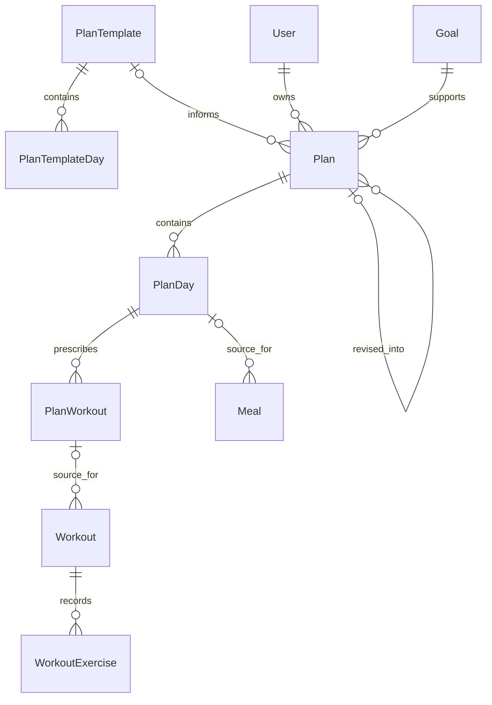
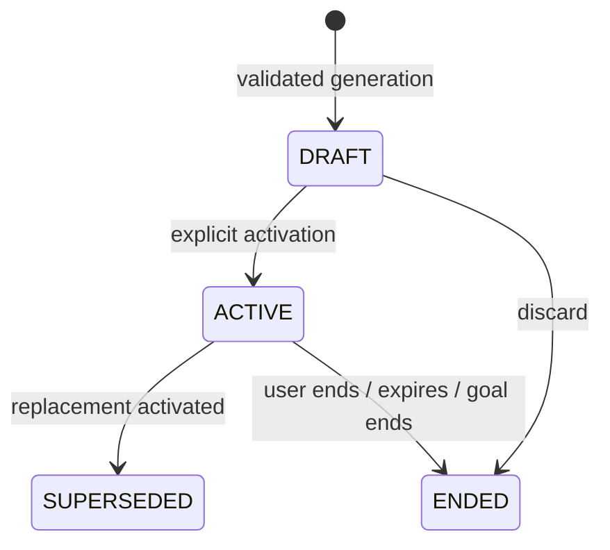

# Plans Module - Proposed Architecture and Contract

Status: design document, not implemented. Written September 14, 2026.

This document defines the proposed Plan module for Spotter. It covers database models, relationships, endpoints, business rules, ownership, and implementation responsibilities. Field and endpoint names below are proposals, not claims about the current API. No migration or runtime change is included with this document.

## 1. Scope and decisions

The user completes a profile, sets an active goal, requests an AI-generated workout and nutrition plan, reviews it, and explicitly activates it. The user then logs actual meals and workouts against that plan. Revisions produce another draft; they never silently replace the active plan.

### Confirmed boundaries

- Templates are internal generation references, independent of personalized plans.
- Plans belong to individual users and retain previous versions.
- Planned activity and actual logs are separate records.
- Completed workouts remain read-only and cannot be deleted. Plan features do not weaken this existing rule.
- Workout calorie-burn estimation and MET integration are deferred. Planned nutrition calories and macros remain in scope.
- Human-coach accounts, permissions, assignment, and communication are outside the MVP.
- AI chat is a separate module. It may request a plan revision through this module, but cannot bypass review and activation.

### Proposed defaults for this design

These choices make the contract concrete for review; they are not previously approved product requirements.

| Decision | Proposed MVP behavior |
| --- | --- |
| Schedule | A seven-day schedule repeats between the plan's start and end dates. Different prescriptions for week 1 and week 2 require a later extension. |
| Activation | Immediate, explicit activation only. Start date must be today in the plan timezone. Future-dated drafts can be reviewed but wait until their start date to activate. |
| Editing | Users may change a draft's title and dates. Content changes go through a new generation/revision request. |
| Retention | No user-facing plan deletion endpoint. Unwanted drafts can be ended; historical plans remain readable. |
| Generation transport | A bounded synchronous generation request initially. Add a durable generation-job model and polling if provider latency exceeds the HTTP deployment limits. |
| Template access | Seeded/internal templates; no public template CRUD or template administration UI. Templates are optional for generation. |
| Nutrition styles | Preserve all existing `NutritionPlanStyle` values, with explicit validation for each style. |

Related documents: [MVP journey](1-MVP.md), [Goals](GoalsModule.md), [Profiles](ProfilesModule.md), [Workouts](WorkoutsModule.md), [Workout exercises](WorkoutExercisesModule.md), [Meals](MealsModule.md), and [Progress/daily summary contract](frontend/progress-daily-summary-api-contract.md).

The older MVP text includes editing/deleting logged workouts and calories burned. For this module, the session decisions above take precedence. Updating that document and changing the existing summary calculation are separate implementation tasks.

## 2. Model overview and relationships



The optional source relationships to `Workout` and `Meal` are proposed additions. Manual activity has no plan source. Meal options and exercise prescriptions remain validated JSON in this version, so their IDs inside JSON are not database foreign keys.

| Prisma model | PostgreSQL table | Owner and purpose |
| --- | --- | --- |
| `PlanTemplate` | `plan_templates` | Internal reusable program reference; not owned by a customer. |
| `PlanTemplateDay` | `plan_template_days` | A numbered training day within a template. |
| `Plan` | `plans` | One user's independently saved prescription and generation metadata. |
| `PlanDay` | `plan_days` | One weekday's meal options, guidance, and workout schedule. |
| `PlanWorkout` | `plan_workouts` | One prescribed session within a plan day. |

No separate `PlanWorkoutExercise`, `PlanMeal`, or generation-job table is required by this proposed first version. Their responsibilities are represented by versioned JSON and module services. Normalize later when querying or lifecycle requirements justify it.

## 3. Enums

| Enum | Values | Meaning |
| --- | --- | --- |
| `PlanStatus` | `DRAFT`, `ACTIVE`, `SUPERSEDED`, `ENDED` | Reviewable, in use, replaced, or ended/discarded. |
| `DayOfWeek` | `MONDAY` through `SUNDAY` | Local calendar weekday, not an absolute timestamp. |
| `WorkoutSlot` | `MORNING`, `AFTERNOON`, `EVENING`, `ANYTIME` | Display/scheduling preference; not an exact appointment time. |

Reuse `GoalType`, `TrainingExperienceLevel`, `NutritionPlanStyle`, and `MealType` from existing modules. Source is `AI` for this release; store it explicitly rather than inferring it from a template or conversation.

## 4. Models and fields

IDs use UUIDs. Audit timestamps use PostgreSQL `timestamptz`; local schedule dates use `date`. Foreign-key names use the existing snake_case mapping convention.

### 4.1 PlanTemplate

| Fields | Purpose and rules |
| --- | --- |
| `id`, `name`, `description` | Internal template identity and explanation. |
| `goalType`, `experienceLevel` | Template-selection filters, not proof of suitability for a particular user. |
| `durationWeeks` | Optional intended program duration; positive if supplied. Does not create multiweek progression. |
| `version` | Proposed positive integer identifying the reference revision. |
| `isActive` | Proposed availability flag. Inactive templates cannot be selected for new generation. |
| `createdAt`, `updatedAt` | Audit fields. |
| `days`, `plans` | Reverse relationships. |

Index `(goalType, experienceLevel)`. Archive references in ordinary use. Template edits never propagate into saved plans. Capture the chosen template name/version in the plan's generation metadata so history remains interpretable even if the source is removed.

### 4.2 PlanTemplateDay

| Fields | Purpose and rules |
| --- | --- |
| `id`, `planTemplateId` | Identity and parent reference. |
| `dayNumber` | Positive ordinal within the template, unique with `planTemplateId`. This means training day 1, not Monday. |
| `name` | For example, Upper Body or Lower Body. |
| `workoutBlueprint` | Optional validated JSON containing focus, movement patterns, and duration guidance. |
| `nutritionBlueprint` | Optional validated JSON containing nutrition structure guidance. Never overrides the user's restrictions or backend targets. |
| `notes` | Additional internal guidance. |

Deleting an unused template may cascade to its template days. A personalized plan must not depend on reading the live template to render its saved content.

### 4.3 Plan

| Fields | Purpose and rules |
| --- | --- |
| `id`, `userId`, `goalId` | Identity, authenticated owner, and goal. The goal must belong to that user. |
| `sourceTemplateId` | Optional provenance reference; `SetNull` if its source is removed. |
| `parentPlanId` | Optional previous version. Same owner and goal; never self-reference. |
| `status` | Server-controlled, initially `DRAFT`. |
| `title`, `explanation` | User-facing name and explanation of the prescription. |
| `nutritionPlanStyle` | Snapshot of the selected existing nutrition style. |
| `calorieTarget`, `proteinTargetGrams`, `carbohydrateTargetGrams`, `fatTargetGrams` | Backend-calculated daily target snapshot. Required before activating this combined workout/nutrition plan. |
| `startDate`, `endDate` | Inclusive local date coverage. May be absent on an incomplete draft; both required at activation. `endDate >= startDate`. |
| `timezone` | Proposed required IANA timezone snapshot used for this schedule. |
| `activatedAt`, `endedAt` | Actual lifecycle instants. `endedAt` also records when a plan is superseded. |
| `sourceType` | Proposed explicit `AI` origin for display. |
| `schemaVersion` | Proposed positive integer for the generated content contract. |
| `generationMetadata` | Proposed internal JSON: model identifier, prompt version, generation time, template snapshot, target calculator version, and context revision/fingerprint. |
| `createdAt`, `updatedAt` | Server audit fields. |
| `days`, `parentPlan`, `revisions` | Composition and revision chain. |

Use the proposed partial unique index on `userId WHERE status = 'ACTIVE'`. Add indexes for owner/status, goal, parent plan, and template lookup. `User` and `Goal` need reverse `plans` relations.

Keep `goalId` restricted against deletion while plans reference it; existing goals already have no user-facing delete endpoint. Keep published plans through ordinary ending/replacement. User-account deletion is a separate privacy lifecycle and must explicitly handle these dependencies.

Avoid copying the entire private health profile or raw AI prompt into metadata. Save only the minimal generation context needed for reproducibility; detailed context retention/redaction requires an explicit policy before implementation.

### 4.4 PlanDay

| Fields | Purpose and rules |
| --- | --- |
| `id`, `planId`, `dayOfWeek` | Unique `(planId, dayOfWeek)`. Exactly seven day records are required at activation. |
| `breakfastOptions`, `lunchOptions`, `dinnerOptions`, `snackOptions` | Optional validated JSON arrays of alternative complete meals. An option may contain several food/recipe items. |
| `nutritionGuidance` | Particularly useful for macro-based and simple-guidance styles. |
| `notes` | Day-specific user-facing explanation. |
| `workouts` | Ordered prescribed sessions. Empty means an explicitly scheduled rest day once the complete seven-day plan has been validated. |

No calorie-consumption totals or mutable completion flags live here. Those values come from actual logs for a particular date.

For `EXACT_MEALS`, each scheduled meal slot has one primary option. For `FLEXIBLE_MEALS`, alternatives belong to the same slot and are not summed as though all were eaten. For `MACRO_BASED` and `SIMPLE_GUIDANCE`, arrays may be null and guidance/targets provide the prescription.

The four fixed meal buckets do not model arbitrary numbers of scheduled meals. This is a deliberate proposed simplification; see section 13 if multiple separate snacks or custom meal times are required.

### 4.5 PlanWorkout

| Fields | Purpose and rules |
| --- | --- |
| `id`, `planDayId` | Identity and parent. |
| `slot`, `name` | Schedule preference and user-facing session name. |
| `orderIndex` | Proposed positive display order, unique within the day. Several workouts may use `ANYTIME`. |
| `estimatedDurationMinutes` | Positive planned duration. Never copied into actual workout duration as performed activity. |
| `exercises` | Required nonempty JSON array following the prescription contract below. |
| `notes` | Instructions for the prescribed session. |

The prescription is read-only once the parent plan is activated. It has no `completed` flag: the same prescription can recur on multiple dates.

## 5. JSON contracts and catalog references

### Exercise prescription example

```json
{
  "id": "server-issued-prescription-item-uuid",
  "exerciseId": "catalog-exercise-uuid",
  "exerciseName": "Dumbbell Bench Press",
  "setsCount": 3,
  "repMin": 8,
  "repMax": 10,
  "weightKg": null,
  "durationSeconds": null,
  "distanceMeters": null,
  "restSeconds": 90,
  "notes": "Choose a manageable load."
}
```

Names and stable item IDs are assigned/resolved by the backend, not trusted from the model. Numeric fields are positive where applicable; a prescribed load can be zero or absent. Validate ordered rep ranges and allowed fields against catalog tracking metrics. A timed movement uses duration; distance is supported where the catalog permits it. Do not require a rep range for a timed-only movement.

Reject duplicate exercise IDs within one prescribed session for the MVP: the existing `WorkoutExercise` table allows an exercise only once per workout. Supersets or repeated blocks that violate that constraint need an explicit future model change.

### Meal option example

```json
{
  "id": "server-issued-meal-option-uuid",
  "label": "Primary breakfast",
  "items": [
    {
      "itemType": "RECIPE",
      "recipeId": "catalog-recipe-uuid",
      "servings": 1.5,
      "itemName": "Recipe name snapshot",
      "calories": 450,
      "proteinGrams": 30,
      "carbohydrateGrams": 45,
      "fatGrams": 16
    }
  ],
  "note": "An example option; the numbers are illustrative."
}
```

Food items use `foodId` and `quantityGrams`; recipe items use `recipeId` and `servings`. Never accept both quantity forms for one item. Resolve authorized catalog items and compute their nutrition server-side. Store the resulting name, quantity, and nutrient snapshots so catalog edits do not rewrite a published plan. Preserve legitimate fractional macros and portions in JSON.

All catalog IDs inside JSON require explicit existence, availability, and access checks. Foreign-key enforcement does not reach inside these arrays. Validate during generation and again before activation. On logging, resolve the chosen items through the existing Meals module and record what was actually eaten; catalog changes may require a substitution, which must not rewrite the plan snapshot.

JSON schemas must reject unknown fields, unsupported versions, invalid quantities, oversized arrays, and excessive text. Field limits should come from shared configuration rather than duplicated frontend and backend constants.

## 6. Links to actual activity

### Proposed additions to existing models

| Existing model | Proposed fields | Purpose |
| --- | --- | --- |
| `Workout` | `sourcePlanWorkoutId?`, `scheduledDate?`, `scheduleTimezone?` | Identify the prescribed session and its local-date occurrence. Add the optional relation and reverse `PlanWorkout.workouts`. |
| `Meal` | `sourcePlanDayId?`, `sourceMealOptionId?`, `scheduledDate?`, `scheduleTimezone?` | Identify a selected option and occurrence. Add the optional relation and reverse `PlanDay.meals`; the option ID is validated against JSON. |

All source fields are server-validated provenance. Manual logs leave them null. Source attribution cannot be reassigned after creation; actual editable meal contents remain independent. Ordinary plan ending/replacement never cascades into logs. Use restrictive source relationships for retained plans; exceptional account erasure requires an explicit deletion order.

`scheduledDate` identifies the intended occurrence; actual timestamps identify when activity happened. Daily consumption/activity totals continue to use actual timestamps in the summary's timezone. Adherence uses the source occurrence. Do not move actual consumption into a scheduled day simply because its plan says so.

### Starting a prescribed workout

1. Resolve the owned active plan, matching local day and prescribed session.
2. For the proposed live-only plan-start action, require `scheduledDate` to be today in the plan timezone and within its coverage.
3. Use the Workouts module's existing one-in-progress-workout rule.
4. Create an actual `IN_PROGRESS` workout with source information, current server start time, and no completed activity.
5. Return the prescription beside the actual session. Users add actual exercise measurements through existing workout-exercise endpoints.
6. Do not silently translate a prescribed `8-10` rep range into ten reps performed. The actual model requires a single `repsPerSet` value. Planned duration/load are not evidence of actual results.
7. Completion/cancellation use existing Workouts endpoints. Completed sessions remain locked even if their plan is superseded.

Proposed occurrence rule: allow at most one `IN_PROGRESS` or `COMPLETED` workout for `(sourcePlanWorkoutId, scheduledDate)`, enforced with a partial unique index. A cancelled attempt permits a new attempt. Duplicate start requests should return the existing matching in-progress session; a different in-progress session or a completed occurrence returns a conflict.

Switching plans does not cancel an in-progress workout already started from the previous plan. It may finish against its retained source, but new sessions cannot start from that superseded plan.

### Logging a prescribed meal

The client selects an option, opens an editable meal draft, adjusts the actual foods/quantities, and saves through `POST /api/meals`. Extend that endpoint with a validated optional `planSource` object; do not create an additional consumption-writing endpoint in the Plans module.

The source day/option must belong to the user and have been applicable to the scheduled date. Prior ended/superseded plans can still be referenced for a meal eaten while that plan was in effect. Source options are suggestions, not an assertion that the meal exactly matched them. Editing/deleting a meal follows existing Meals rules and never changes the prescribed option. Prevent accidental duplicate submissions in the meal-writing flow; do not prohibit intentional repeat consumption.

## 7. Endpoint contract

All endpoints require authentication. Obtain `userId` from `req.user.id`. Success responses use `{ "data": ... }`, with `Cache-Control: no-store`. Errors use the existing `{ "error", "code", "details" }` convention. Register `/config`, `/context`, `/active`, and `/schedule` before `/:planId`.

### Plans-owned endpoints

| Method and path | Request | Result | Responsibility |
| --- | --- | --- | --- |
| `GET /api/plans/config` | None | `200`: enums, supported styles, limits, schema version, required inputs | Let the UI render the contract without hardcoding it. |
| `GET /api/plans/context` | None | `200`: readiness, missing fields, target preview, relevant context revision | Explain what must be provided before generation. Do not expose raw prompts or internal reasoning. |
| `POST /api/plans/generate` | `{ startDate, endDate, preferences? }` | `201`: saved validated `DRAFT` and full content | Select current goal, context, optional template, generate, validate, save. |
| `GET /api/plans` | Optional `status`, `goalId`, `page`, `limit` | `200`: `{ items, pagination }`, newest first | List owned draft, active, and historical plans. |
| `GET /api/plans/active` | None | `200`: active plan or `null` | Current usable plan, after resolving expiration/invalid goal state. |
| `GET /api/plans/schedule?date=YYYY-MM-DD` | Required local date | `200`: applicable plan segments, prescribed content, occurrence-linked logs | Today's or a previous day's schedule; see historical semantics below. |
| `GET /api/plans/:planId` | UUID parameter | `200`: complete owned plan, days and ordered workouts | Review a draft or inspect history. |
| `PATCH /api/plans/:planId` | Subset of `{ title, startDate, endDate }` | `200`: updated draft | Metadata/date edits on `DRAFT` only; validate the merged date interval. |
| `POST /api/plans/:planId/revisions` | `{ instructions, startDate, endDate }` | `201`: new `DRAFT` with `parentPlanId` | Regenerate content against fresh context; never mutate the parent. |
| `POST /api/plans/:planId/activate` | `{ expectedActivePlanId: UUID or null }` | `200`: newly active plan | Atomically activate the reviewed draft and supersede the expected previous active plan. |
| `POST /api/plans/:planId/end` | Empty object | `200`: ended plan | End an active plan or discard a draft. |

`preferences` and revision instructions are bounded requests, not permissions to override backend ownership, targets, health constraints, or activation rules. Persist dates as validated local dates, not browser-midnight UTC conversions.

There is no direct client endpoint for writing AI-generated JSON into `PlanDay`/`PlanWorkout`, no public template CRUD, and no `DELETE /api/plans/:planId` in this proposal.

### Cross-module endpoints

| Method and path | Proposed contract | Owning module |
| --- | --- | --- |
| `POST /api/workouts/from-plan` | `{ planWorkoutId, scheduledDate }`; returns `201` new actual workout, or `200` matching in-progress occurrence on repeat | Workouts, using a Plans service to resolve and authorize the prescription. |
| `POST /api/meals` | Existing actual meal payload plus optional `planSource: { planDayId, optionId, scheduledDate }` | Meals, using Plans to validate the historical source. |
| Existing workout-exercise and workout completion/cancellation endpoints | Record actual performance; no plan-content mutations | Workout exercises / Workouts. |
| Existing daily summary endpoint | Actual food totals plus separately labelled plan context/adherence if included | Daily Summary. |

### Historical schedule response

A weekday alone is insufficient for history. Resolve plans whose date coverage and actual activation interval overlap the requested local day. Return an explicit empty schedule when none apply.

A same-day replacement can produce two applicable plan segments. Return both with their `effectiveFrom`/`effectiveUntil` instants and source-linked logs; designate only the currently effective segment for new actions. Do not show old logs against the replacement prescription. The current user's timezone determines the query day; each returned plan retains its own timezone for weekday/occurrence interpretation. Include those timezone values in the response.

The snapshot on `Plan` is a planned nutrition target. The current profile target may change after a check-in. Expose these as distinct values until a documented Daily Summary integration chooses its target source; do not silently replace the existing daily target calculator.

## 8. Lifecycle, activation, and business rules



1. There is at most one active plan per user, enforced by the database and service.
2. Any owned plan can be used as revision reference, but generation always targets that same still-active goal. A new goal requires a fresh generation, not a cross-goal revision chain.
3. Draft creation, revision, and failure do not alter the active plan or any activity log.
4. Active, ended, and superseded content is immutable. Only server lifecycle metadata changes. Terminal plans cannot be reactivated; generate a new draft.
5. Activation requires the owned active goal, complete seven-day content, required targets, valid catalog access, valid dates/timezone, and current applicable profile constraints.
6. Re-read context at activation. A changed goal, timezone, target-calculation input, health restriction, food restriction, equipment, or availability can make a draft stale. Reject with actionable details and request regeneration; do not silently modify reviewed content. New unrelated activity alone need not invalidate a draft.
7. A weekday can contain multiple ordered sessions or an explicit rest day. Missing weekdays and missing AI output are not rest days.
8. Scheduling and prescription must respect the user's availability, equipment, experience, restrictions, and session length. Template selection is guidance, not authorization to ignore context.
9. Nutrition totals come from backend targets and catalog data. Validate the day's primary choices against configured tolerances; validate alternatives separately instead of adding all options together.
10. Unknown/insufficient restriction information must be surfaced. The AI must not invent catalog facts or approve a professional-clearance requirement. The exact eligibility and tolerance policy is an implementation prerequisite in section 13.
11. Planned meals never count as consumed, and planned exercises never count as completed. Progress check-ins and actual logs survive revision/replacement unchanged.
12. No workout-burn estimate is requested, stored by this module, or added to the food budget. Proposed food remaining is target minus consumed calories; existing summary behavior still needs its separate update.

### Atomic activation sequence

1. Authenticate and validate the request.
2. In a short database transaction, acquire a consistent per-user lock shared by plan activation, relevant goal transitions, and profile deletion.
3. Load the owned draft and current goal/context; validate readiness and the reviewed draft's context revision.
4. Resolve any expired active plan, then compare the current active plan ID with `expectedActivePlanId`. If another tab changed it, return `409 PLAN_ACTIVE_CHANGED` without replacing anything.
5. Mark the previous active plan `SUPERSEDED` with `endedAt = now` if present.
6. Mark the draft `ACTIVE` with `activatedAt = now`; commit both changes together. Any failure rolls back both.
7. Treat an immediate retry for the same already-active plan as successful. Never let a retry reactivate a terminal plan.

Do not hold database locks while calling the AI provider. Recheck important inputs after generation and before saving/activating. All callers of the shared lifecycle operations must follow the same locking order; a unique index alone does not prevent stale-context or goal-transition races.

### End and expiration semantics

- `end` on a draft sets `ENDED` without an activation timestamp; on an active plan it closes its activation interval. Repeating `end` on `ENDED` can return the saved result. `SUPERSEDED` stays superseded.
- An end date is inclusive: coverage stops at midnight starting the next local date in the plan timezone. Use timezone-aware boundaries, not a fixed 24-hour addition.
- Read/start/activation paths must refuse expired plans even before background cleanup. A reconciler may persist expiration, using the actual coverage boundary as `endedAt`, not the later cleanup time.
- Completing/cancelling a goal ends its active plan and discards its pending drafts in the same coordinated operation. Profile deletion similarly ends/discards unusable plans and follows the privacy policy for stored context.
- Ordinary profile edits do not rewrite an active plan. Surface that it needs review; where updated restrictions make starting it inappropriate, block new plan-start actions until revised.

## 9. Ownership and access

| Resource/action | Allowed actor | Required checks |
| --- | --- | --- |
| Template maintenance | Internal seeding/maintenance process | Trusted reference validation; no customer ownership field. |
| Generate/read/revise/end plan | Authenticated owner | Scope every lookup by owner. Validate goal and parent ownership. |
| Activate plan | Authenticated owner | Full readiness checks, current goal, expected active plan, atomic replacement. |
| Read a day/workout/meal option | Parent plan's owner | Traverse the parent chain; a child UUID alone grants no access. |
| Use recipe/food catalog item | Owner of plan, subject to catalog visibility | Global available item or accessible user-created item. Never another user's private item. |
| Start/log activity from plan | Owner of both source plan and actual log | Validate occurrence, source availability, timestamps, and current module rules. |
| AI provider | No direct database or activation authority | Receives bounded authorized context; returns proposed content only. |

Return the same `404` for missing and unowned private resources. Reject client-supplied `userId`, lifecycle timestamps/status, source attribution, generation metadata, and calculated target overrides. Apply owner scoping to list filters as well as detail routes.

Plans may reveal private goals, restrictions, or eating preferences. Do not expose them through public profiles, templates, shared caches, provider-error messages, or ordinary request logs. Serialize only the fields needed by the client; internal prompts and generation metadata are not automatically public API fields.

## 10. Module and layer responsibilities

```text
src/modules/plans/
  plan.routes.js
  plan.validation.js
  plan.controller.js
  plan.service.js
  plan.rules.js
  plan.repository.js
  plan.serializer.js
  plan.context.js
  plan.generation.js
  plan.content-schema.js
  planTemplate.repository.js
```

| Component | Owns | Does not own |
| --- | --- | --- |
| Routes/middleware | Authentication, size limits, generation-specific rate limits, validation dispatch | Business decisions or provider prompts. |
| Validation/content schema | Request allowlists, UUIDs/dates, JSON structure, versions and bounds | Database ownership or physiological target calculation. |
| Controller | HTTP inputs/status codes, private cache headers, response envelope | Transactions or AI orchestration. |
| Plan service | Ownership, lifecycle, orchestration, transactions, source resolution | Direct manipulation of actual measurements/consumption. |
| Rules | Pure readiness, date, content and transition checks | Database access or network calls. |
| Repository | Scoped Prisma queries, locks, nested writes, conditional transitions | User-facing policy or model-generated authority. |
| Serializer | Stable client contract, numeric/date formatting, hiding internal metadata | Recalculating actual activity as planned activity. |
| Context builder | Authorized profile/goal/history/catalog inputs and minimal context revision | Copying unlimited histories or unrelated user data. |
| Generation adapter | Provider request, bounded timeout, structured response parsing | Activation, ownership changes, or writing unvalidated AI output. |
| Template repository | Internal reference lookup and compatible candidate selection | Editing published user plans. |
| Profiles/Goals | Authoritative profile, restrictions, active goal, target calculation | Rewriting historical plan content. |
| Workouts/Workout exercises | Actual session lifecycle and performed measurements | Changing prescriptions when actual results differ. |
| Meals | Actual food quantities, nutrient snapshots, edit/delete behavior | Marking suggested options as eaten automatically. |
| Daily Summary/Progress | Actual totals and progress, separately identified plan comparison | Inferring completion just because a plan exists. |
| Future AI chat | Conversation storage and user requests routed to Plans | Silent plan activation or ownership bypass. |

The context builder reads bounded recent history with explicit limits and timestamps. A model may suggest only authorized catalog IDs. Resolve names, IDs, portions, and numeric calculations on the backend; do not assume structured model output is valid because it parses as JSON.

## 11. Generation flow and failure handling

1. Read authenticated user's context and active goal.
2. Return missing prerequisites before calling the provider; persist answers through existing Profile/Onboarding endpoints.
3. Calculate targets with the existing backend calculator and select optional compatible template guidance.
4. Build a bounded catalog/context payload, with a versioned output schema.
5. Call the provider outside a database transaction, using a configured timeout.
6. Validate structure, catalog access, prescription compatibility, meal nutrition, and context constraints. Reject incomplete or unsupported output.
7. Recheck relevant context revisions. Save the complete draft, seven days, and workouts atomically. Never save a half-generated plan as a ready draft.
8. Return the draft for review. Nothing becomes active in this flow.

Provider failure/timeout creates no usable plan and leaves the active plan unchanged. A first synchronous implementation has no durable job to poll; the API must not return `202` or promise background completion. Retrying may incur a second provider call. If durable retries/deduplication are required, add a request/job table with owner-scoped idempotency keys rather than an in-memory promise.

| HTTP | Proposed code | Meaning |
| --- | --- | --- |
| `400` | `PLAN_INVALID_REQUEST` | Invalid UUID/date, unknown field, empty patch, or malformed request. |
| `401` | Existing authentication code | Missing/invalid authentication. |
| `404` | `PLAN_NOT_FOUND` / `PLAN_WORKOUT_NOT_FOUND` / `PLAN_OPTION_NOT_FOUND` | Missing or unowned private resource. |
| `409` | `PLAN_INVALID_STATE` | Mutation incompatible with plan lifecycle. |
| `409` | `PLAN_ACTIVE_CHANGED` | Active plan changed since review. |
| `409` | `PLAN_CONTEXT_CHANGED` | Relevant inputs changed; regenerate/review. |
| `409` | `PLAN_OCCURRENCE_COMPLETED` | Attempt to restart a completed scheduled occurrence. |
| `409` | Existing `ACTIVE_WORKOUT_EXISTS` | Another workout is in progress. |
| `422` | `PLAN_CONTEXT_INCOMPLETE` | Required profile/goal/timezone information missing; return actionable fields. |
| `422` | `PLAN_NOT_ELIGIBLE` | Known constraint prevents automatic generation/start under the defined policy. |
| `422` | `PLAN_CONTENT_INVALID` | Stored draft cannot activate, e.g. unavailable catalog item or incomplete schedule. |
| `429` | Existing rate-limit convention | Generation quota/rate exceeded. |
| `502` | `PLAN_GENERATION_FAILED` | Provider failed or returned unusable content; do not blame user input for malformed model output. |
| `504` | `PLAN_GENERATION_TIMEOUT` | Bounded provider call did not complete. |

Translate database uniqueness races into stable conflicts. Never expose raw provider output, prompts, stack traces, or database errors in client responses.

## 12. Implementation order and acceptance checks

1. Resolve the decisions in section 13, finalize content schemas, and validate the Prisma model additions/migration.
2. Implement plan persistence, owner-scoped reads, lifecycle, and atomic activation using fixture-generated drafts.
3. Add context readiness, template lookup, and validated AI generation.
4. Add plan review/history UI and explicit activation.
5. Integrate planned workout starts and meal-source attribution through their owning modules.
6. Add schedule/history comparison and finalize the separate daily-summary target/burn changes.

Meaningful acceptance checks:

- A draft contains seven unique weekdays, valid recipes/foods/exercises, supported tracking fields, and backend-derived nutrient snapshots.
- Another user cannot read or use a plan, nested workout, meal option, or private catalog reference.
- Concurrent activations never produce two active plans; a stale request cannot silently replace the winner.
- Failed generation/activation preserves the old plan and every log.
- Revisions preserve the parent and do not become active without explicit confirmation.
- A goal transition or profile deletion cannot leave a newly activated unusable plan behind.
- The same repeating Monday prescription has separate dated occurrences; cancellation permits retry, completion does not.
- Starting from a plan does not invent performed reps, duration, completion, or consumed food.
- A workout started before replacement can finish afterward without losing its original source.
- Meal substitutions and edits change actual totals but preserve the plan snapshot.
- Midnight, daylight-saving changes, timezone changes, expiration, and same-day replacement return the correct schedule segments and preserve source attribution.
- No calorie-burn estimator or MET dependency is needed to complete the Plan module.

## 13. Decisions to settle before implementation

| Decision | Proposed direction / unresolved detail |
| --- | --- |
| Repeating week or dated program | Use repeating weekdays now. If each week must differ, change `PlanDay` to dated days or add week indexing before building endpoints. |
| Immediate/future activation | Keep future plans as drafts until their start date. Automatic scheduled switching needs an explicit lifecycle extension. |
| Fixed meal buckets | Keep four buckets only if the MVP supports that schedule. Multiple distinct snacks/custom meal times need ordered meal-slot records or a versioned slots array. |
| Plan versus live nutrition target | Keep both labelled and separate. Agree which value the daily summary uses while a plan is active; never silently blend snapshots with recalculated targets. |
| Safety/eligibility policy | Define which missing answers or clearance flags block generation/start, and what user action resolves them. The provider cannot decide its own authority. |
| Nutrition tolerances | Define tolerances for calories/macros and alternative meal portions centrally before accepting generated content. |
| Generation latency and retries | Confirm deployment/provider time limits. Use the bounded synchronous proposal only while it fits; durable jobs are a separate model and endpoint contract. |
| Privacy retention | Decide how profile deletion handles previously saved explanations/context. Ending a plan alone is not erasure of copied private data. |
| Plan-linked past workouts | The proposed start endpoint is live-only. Accurate past-session logging remains a separate Workouts decision and must collect a real end time before completion. |

## 14. Technical reference

The proposed active-plan uniqueness uses Prisma's `partialIndexes` feature, already enabled in Spotter's schema. See [Prisma index documentation](https://docs.prisma.io/docs/orm/prisma-schema/data-model/indexes). JSON prescription fields need application validation; see [Prisma JSON fields](https://www.prisma.io/docs/orm/v7/prisma-client/special-fields-and-types/working-with-json-fields).
