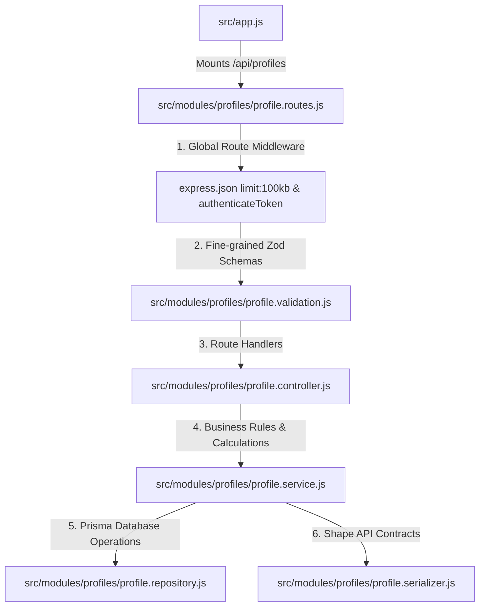

# Profiles Module - Complete Architecture & Flow

This document details the architecture, endpoint breakdown, business rules, and security boundaries of the **Profiles Module** (`/api/profiles`).

---

## 1. High-Level File Integration



---

## 2. Endpoints Overview

| Method | Endpoint | Purpose | Semantics | Security & Body Validation |
| :--- | :--- | :--- | :--- | :--- |
| `GET` | `/api/profiles/config` | Static configuration values | Cacheable config | None |
| `GET` | `/api/profiles/me` | Complete aggregated profile view | Read-only | `authenticateToken` |
| `PATCH` | `/api/profiles/me/public` | First name, last name, display name | Partial Update | `publicProfileUpdateSchema` |
| `PATCH` | `/api/profiles/me/account-preferences` | Timezone, language, measurement units | Partial Update | `accountPreferencesUpdateSchema` |
| `POST` | `/api/profiles/me/body` | Initial baseline physical stats | Create Baseline | `createBodyProfileSchema` |
| `PATCH` | `/api/profiles/me/body` | Height, activity level | Partial Update | `updateBodyProfileSchema` (startingWeightKg forbidden) |
| `DELETE` | `/api/profiles/me/body` | Delete physical profile & cascades | High-Risk Action | Requires password confirmation |
| `PUT` | `/api/profiles/me/health` | Health conditions & injuries | Full Section Replace | `healthProfileSchema` |
| `PUT` | `/api/profiles/me/nutrition` | Dietary constraints & allergies | Full Section Replace | `nutritionProfileSchema` |
| `PUT` | `/api/profiles/me/training` | Equipment, schedule, experience | Full Section Replace | `trainingProfileSchema` |
| `PUT` | `/api/profiles/me/coaching` | AI coach communication settings | Full Section Replace | `coachingPreferencesSchema` |
| `POST` | `/api/profiles/me/progress` | Log current weight & body metrics | Append History | `createProgressEntrySchema` |
| `GET` | `/api/profiles/me/targets` | Calculate BMR, TDEE, & daily macros | Read-only Calculation | Requires active goal + latest weight |

---

## 3. Why Are There Many Profile Endpoints?

In Spotter, **"the user's profile" is not a single database table or permission boundary**. A monolithic `PATCH /me` endpoint was rejected for the following architectural and security reasons:

### A. Preventing Mass Assignment Vulnerabilities
- A generic `PATCH /me` would allow users to submit fields across different security contexts.
- High-privilege attributes (`role`, `emailVerified`, `id`) or stable baselines (`startingWeightKg`) could accidentally be overwritten if mixed with cosmetic profile updates.
- By providing focused endpoints with explicit schemas (e.g., `publicProfileUpdateSchema` only permits `firstName`, `lastName`, `displayName`), unexpected fields are stripped or rejected.

### B. Differing Lifecycles and Ownership
1. **Account Preferences (`PATCH /account-preferences`):** Belongs to the core `User` record (timezone, language, unit preference).
2. **Public Identity (`PATCH /public`):** Safe to show friends and social features (name, avatar, bio). No private medical or weight data can ever leak here.
3. **Body Profile (`/body`):** Private baseline facts (birth date, biological sex for calculations, starting weight).
4. **Sub-Profiles (`PUT /health`, `/nutrition`, `/training`):** Separate domains owned by `BodyProfile`. Health safety, dietary preferences, and gym capacity are independent inputs to plan generation.
5. **Coaching Preferences (`PUT /coaching`):** Belongs directly to the account. If a user resets or deletes their `BodyProfile`, their AI coach communication preferences are preserved.
6. **Progress History (`POST /progress`):** Time-series observation entries (weight check-ins, waist circumference, body fat %). POST always appends history; it never mutates the baseline.

### C. PUT vs PATCH Semantics
- Sections like `/health`, `/nutrition`, and `/training` use **`PUT`** because each request replaces the entire section:
  - Submitting `[]` means *"I have no active injuries/allergies."*
  - Submitting `null` means *"Clear this optional answer."*
- If these used `PATCH`, the server could not distinguish between *"the user omitted the field"* vs *"the user removed their allergies"*.

---

## 4. Core Business Rules & Invariants

1. **Starting Weight Immutability:**
   - In `createMyBodyProfile`, `startingWeightKg` is set once.
   - `updateMyBodyProfile` explicitly excludes `startingWeightKg`. To record weight changes, users must post to `/api/profiles/me/progress`.
2. **Dynamic Age Calculation:**
   - The database stores `birthDate`. Age is **never** stored as a static integer in the database because it would become inaccurate on the user's next birthday.
   - The service dynamically computes exact age on UTC boundaries:
     ```js
     function ageOnDate(birthDate, today = new Date()) { ... }
     ```
3. **Deterministic Medical Clearance Rules:**
   - The frontend is **never trusted** to decide whether a user requires professional clearance.
   - The service inspects `healthConditions` and `specialPlanningStates` against pre-configured risk codes (`PROFESSIONAL_CLEARANCE_CONDITION_CODES`).
   - If any condition is active, the system automatically sets `requiresProfessionalClearance: true`.
4. **Target Calculation Requirements (`GET /me/targets`):**
   - Targets (BMR, TDEE, daily calories, protein/carbs/fat grams) are calculated using the **Mifflin-St Jeor formula**:
     - `BMR (Male) = 10 * weight(kg) + 6.25 * height(cm) - 5 * age + 5`
     - `BMR (Female) = 10 * weight(kg) + 6.25 * height(cm) - 5 * age - 161`
   - Calculation requires both an **active goal** and at least one logged `ProgressEntry`. If missing, the API throws `ActiveGoalRequiredError` or `ProfileIncompleteError`.
5. **High-Risk Action Protection on Deletion:**
   - Deleting `BodyProfile` deletes health, training, nutrition, and progress entries via foreign key cascades.
   - `DELETE /api/profiles/me/body` requires the user's current password in the request body. The service verifies the password against the `bcrypt` hash before proceeding.

---

## 5. Layer Responsibilities & Serialization

- **`profile.routes.js`:** Protects all routes with `authenticateToken`, limits request bodies to `100kb`.
- **`profile.validation.js`:** Strict validation ensuring fields comply with enum bounds and range constraints.
- **`profile.controller.js`:** Attaches `Cache-Control: no-store` to every response containing sensitive health/fitness data.
- **`profile.service.js`:** Coordinates business rules, handles password verification, calculates targets, and orchestrates atomic transactions.
- **`profile.repository.js`:** Exclusively interfaces with Prisma.
- **`profile.serializer.js`:** Sanitizes internal database entities into clean API contracts (converts Prisma `Decimal` values to standard JavaScript floats, formats ISO dates to `YYYY-MM-DD`, and strips internal database primary keys).

---

## 6. How Edge Cases Are Handled

1. **Child Section Writes Without Parent Body:**
   - If a client calls `PUT /me/health` or `POST /me/progress` before creating a `BodyProfile`, `requireBodyProfile` intercepts the call and throws `BodyProfileNotFoundError` (HTTP 404), preventing raw database foreign key constraint errors (`P2003`).
2. **Duplicate Body Creation:**
   - Calling `POST /me/body` when a profile already exists throws `BodyProfileAlreadyExistsError` (HTTP 409).
3. **Invalid Password on Deletion:**
   - If the password supplied in `DELETE /me/body` does not match, the service throws `InvalidActionConfirmationError` (HTTP 401).
