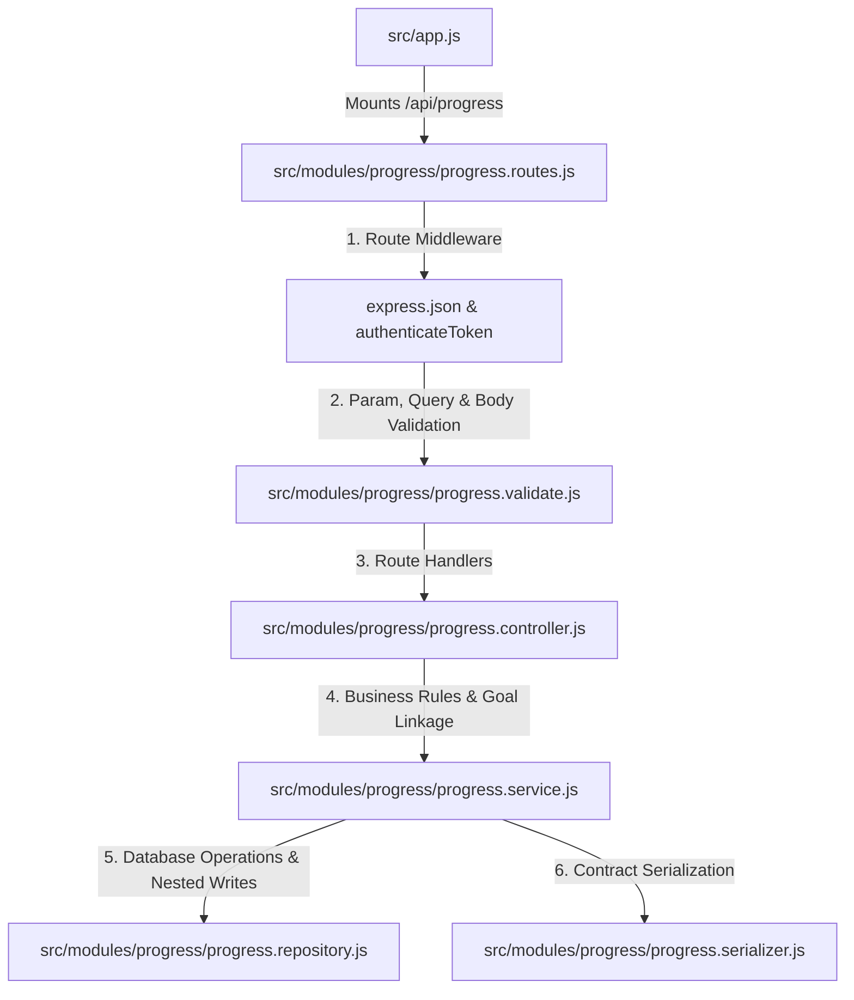
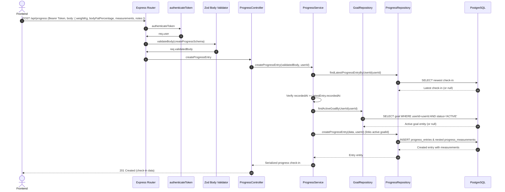
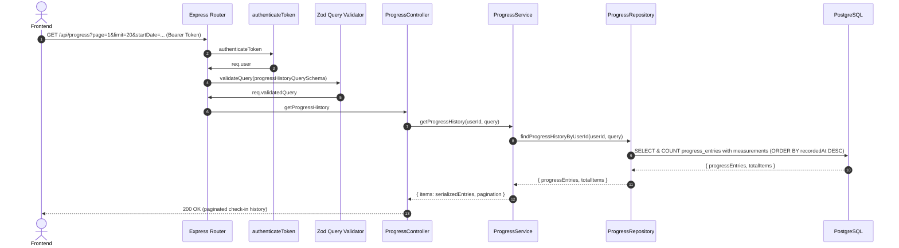
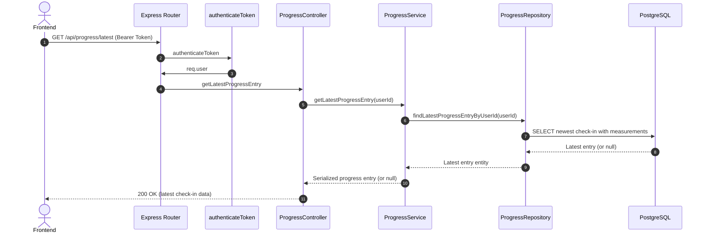

# Progress Module - Complete Architecture & Flow

This document details the architecture, body state snapshotting, baseline vs check-in normalization, active goal linkage, and endpoint structure of the **Progress Module** (`/api/progress`).

---

## 1. High-Level File Integration



---

## 2. Endpoints Overview

| Method | Endpoint | Purpose | Validation | Cache Policy |
| :--- | :--- | :--- | :--- | :--- |
| `POST` | `/api/progress` | Create a new body check-in (weight, metrics, circumferences) | `createProgressSchema` | `no-store` |
| `GET` | `/api/progress` | View paginated check-in history with optional date range | `progressHistoryQuerySchema` | `no-store` |
| `GET` | `/api/progress/latest` | Retrieve single most recent check-in snapshot | None | `no-store` |
| `GET` | `/api/progress/:entryId` | View details of a specific historical check-in | `progressEntryParamsSchema` | `no-store` |

---

## 3. Data Model Architecture

```text
┌─────────────────────────┐
│       BodyProfile       │
│ ─────────────────────── │
│ startingWeightKg (base) │
│ heightCm                │
│ birthDate               │
└────────────┬────────────┘
             │ 1 : N
             ▼
┌─────────────────────────┐         ┌─────────────────────────┐
│      ProgressEntry      │ ──────> │          Goal           │
│ ─────────────────────── │ (N : 1) │ ─────────────────────── │
│ weightKg (current snapshot)       │ targetWeightKg          │
│ bodyFatPercentage       │         │ status (ACTIVE)         │
│ skeletalMuscleMassKg    │         └─────────────────────────┘
│ restingHeartRateBpm     │
│ recordedAt              │
└────────────┬────────────┘
             │ 1 : N
             ▼
┌─────────────────────────┐
│   ProgressMeasurement   │
│ ─────────────────────── │
│ measurementType (WAIST) │
│ valueCm                 │
└─────────────────────────┘
```

### Architectural Principles:
1. **Immutable Baseline vs Snapshot History**:
   * `BodyProfile.startingWeightKg` is set once during onboarding and never updated.
   * Every new weigh-in or measurement is appended as a new `ProgressEntry`.
   * The latest `ProgressEntry` is read dynamically as the user's `currentBodyState`.
2. **Automatic Active Goal Tagging**:
   * When logging a check-in, the service checks if an `ACTIVE` goal exists and attaches `goalId: activeGoal.id`.
   * An initial check-in is flagged with `isInitialForGoal: true` to record starting weight for milestone calculations.
3. **Chronological Integrity**:
   * A check-in timestamp `recordedAt` cannot be in the future, and cannot be older than the newest recorded check-in for the user.

---

## 4. Request Sequences & Execution Flows

### A. `POST /api/progress` (Create Progress Check-In)



### B. `GET /api/progress` (Paginated Check-In History)



### C. `GET /api/progress/latest` (Latest Snapshot)



