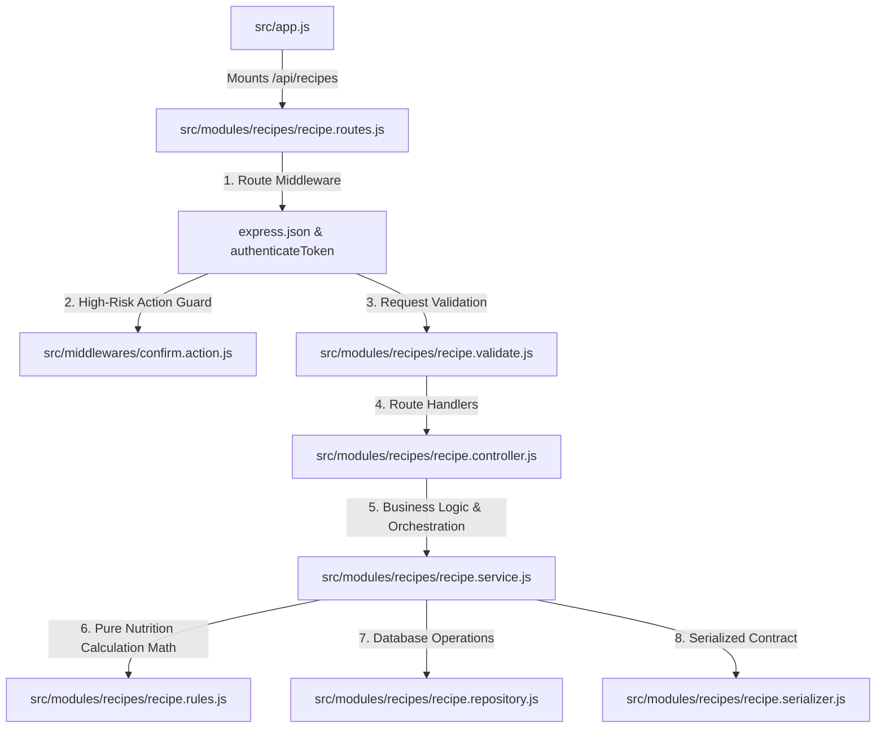

# Recipes Module - Complete Architecture & Flow

This document details the architecture, automated nutritional aggregation, endpoint design, and security invariants of the **Recipes Module** (`/api/recipes`).

---

## 1. High-Level File Integration



---

## 2. Endpoints Overview

| Method | Endpoint | Purpose | Security & Validation | Expected Response |
| :--- | :--- | :--- | :--- | :--- |
| `GET` | `/api/recipes` | Recipe overview (recent recipes used + custom user recipes) | Authenticated | `{ recentRecipes: [...], customRecipes: [...] }` |
| `GET` | `/api/recipes/search` | Search global and custom recipes by query & cuisine | `searchRecipesQuerySchema` | Paginated recipe summary list |
| `GET` | `/api/recipes/:recipeId` | Retrieve full recipe with ingredient breakdown and macros | `recipeIdParamSchema` | 200 with complete recipe details |
| `POST` | `/api/recipes` | Create custom recipe from ingredients | `createRecipeSchema` | 201 with created recipe and auto-calculated nutrition |
| `PUT` | `/api/recipes/:recipeId` | Replace owned recipe ingredients and recalculate totals | `replaceRecipeSchema` | 200 with updated recipe details |
| `DELETE` | `/api/recipes/:recipeId` | Soft-delete (archive) owned recipe | `confirmActionController` (password) | 204 No Content |

---

## 3. Why Recipes Are Structured Like That

### A. Authoritative Server-Side Nutrition Calculations
- **The Rationale:** A client does **not** send calories, protein, carbs, or fat when creating a recipe.
- If clients calculated macros, typos or deliberate tampering could produce recipes with impossible macros (e.g., 500g of chicken breast yielding 50 kcal).
- The client provides only:
  1. An array of ingredient foods and quantities: `[{ foodId, quantityGrams: 250 }, ...]`.
  2. The number of servings: `servings: 4`.
- The backend loads the verified database nutrition for each food per 100g, calculates exact totals, divides by servings, and rounds to 2 decimal places using `Prisma.Decimal`.

### B. Static Route Ordering Precedence
- In `recipe.routes.js`, `GET /search` is registered **before** `GET /:recipeId`.
- **Reason:** Express evaluates route paths in registration order. If `/:recipeId` were declared first, a request to `/api/recipes/search` would attempt to parse `"search"` as a UUID, causing a validation failure.

### C. Soft-Deletion (Archiving) vs Hard Deletion
- When a user deletes a recipe, `recipeRepository.archiveOwnedRecipe` sets `archivedAt = new Date()` and `isActive = false`.
- **Reason:**
  1. Archived recipes disappear from overview and search queries.
  2. The recipe entity remains intact in PostgreSQL to prevent breaking referential integrity or historical logs.

### D. Password Confirmation on Deletion
- Deleting a custom recipe is a destructive action.
- The route binds `confirmActionController`:
  ```js
  recipeRoutes.delete("/:recipeId", validateParams(...), validateBody(deleteRecipeSchema), confirmActionController, ...);
  ```
- The request body must include the user's password (`deleteRecipeSchema`). The middleware verifies the password hash using `bcrypt.compare` before reaching the controller.

---

## 4. Core Business Rules & Nutritional Calculations (`recipe.rules.js`)

1. **Ingredient Accessibility Verification:**
   - In `prepareRecipe`, the system reads all `foodId` values from the request and queries `findAccessibleIngredientFoods`.
   - The user may only use global catalog foods (`createdByUserId == null`) or their own custom foods (`createdByUserId == userId`). Using another user's private food is blocked.
2. **Nutritional Formulas:**
   - For each ingredient:
     $$\text{factor} = \frac{\text{quantityGrams}}{100}$$
     $$\text{ingCal} = \text{food.caloriesPer100g} \times \text{factor}$$
     $$\text{ingProtein} = \text{food.proteinGramsPer100g} \times \text{factor}$$
     $$\text{ingCarbs} = \text{food.carbohydrateGramsPer100g} \times \text{factor}$$
     $$\text{ingFat} = \text{food.fatGramsPer100g} \times \text{factor}$$
   - Total Recipe Nutrition:
     $$\text{totalYieldGrams} = \sum \text{quantityGrams}$$
     $$\text{caloriesPerServing} = \frac{\sum \text{ingCal}}{\text{servings}}$$
     $$\text{proteinPerServing} = \frac{\sum \text{ingProtein}}{\text{servings}}$$
     $$\text{carbsPerServing} = \frac{\sum \text{ingCarbs}}{\text{servings}}$$
     $$\text{fatPerServing} = \frac{\sum \text{ingFat}}{\text{servings}}$$
3. **Immutability of Global Catalog Recipes:**
   - Pre-seeded global catalog recipes (`createdByUserId == null`) cannot be updated or archived by regular users.
   - `replaceOwnedRecipe` and `archiveOwnedRecipe` enforce `createdByUserId === userId`.

---

## 5. Layer Responsibilities

- **`recipe.routes.js`:** Enforces authentication, route ordering, and middleware chaining.
- **`recipe.validate.js`:** Validates ingredient arrays (min 1, max 100), positive servings, positive gram quantities, and password confirmation.
- **`recipe.service.js`:** Coordinates ingredient fetching, invokes pure calculation rules, and manages persistence.
- **`recipe.rules.js`:** Pure functional calculation module. Contains zero database dependencies; performs decimal-precise arithmetic.
- **`recipe.repository.js`:** Prisma data layer handling recipe search, ownership verification, and transaction-wrapped replacements.
- **`recipe.serializer.js`:** Injects ownership flags (`isCustom: recipe.createdByUserId === userId`) and formats decimal values to clean JavaScript numbers.

---

## 6. How Edge Cases Are Handled

1. **Inaccessible or Non-Existent Ingredients:**
   - If a request specifies 4 ingredient foods, but only 3 are accessible, `foods.length !== foodIds.length` triggers `InvalidRecipeIngredientsError` (HTTP 400).
2. **Incorrect Password on Delete:**
   - If the password supplied in `DELETE /:recipeId` is wrong, `confirmActionController` throws `InvalidActionConfirmationError` (HTTP 401).
3. **Attempting to Edit Inactive / Archived Recipes:**
   - `findOwnedActiveRecipe` filters strictly on `isActive: true`. Attempting to update an archived recipe returns `RecipeNotFoundError` (HTTP 404).
