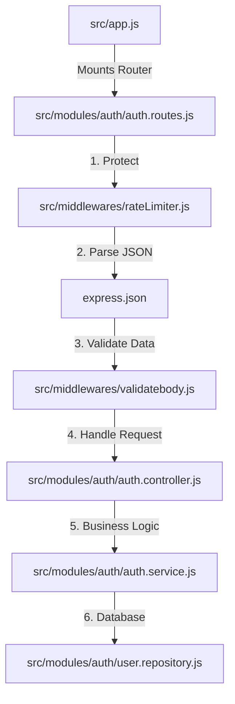

# POST /api/auth/signup - Complete Architecture & Flow

This document provides an in-depth breakdown of how the Signup endpoint is constructed, how the files integrate, and the exact roles of every function in the pipeline.

---

## 1. High-Level File Integration

Our application uses a strict layered architecture to separate concerns. When a request hits the server, it travels through these files in exact order:

---

## 2. Detailed Function Breakdown

### A. The Router Setup (`auth.routes.js`)
**Function:** `authRoutes.post("/signup", ...middlewares, signupController)`
*   **Role:** This file acts as the conductor. It takes the incoming HTTP request and passes it through an array of functions. If any middleware fails (e.g., rate limit hit, or validation fails), the chain stops and the controller is never reached.

### B. The Rate Limiter (`middlewares/rateLimiter.js`)
**Function:** `signupRateLimiter(req, res, next)` (Generated by `express-rate-limit`)
*   **Role:** Security layer.
*   **How it works:** It reads the `req.ip`. It keeps a temporary memory store of how many times that IP has hit this route in the last 15 minutes. 
*   **Integration:** If the count is > 5, it intercepts the request, sends a `429 Too Many Requests` response, and stops the chain. Otherwise, it calls `next()`.

### C. The Validator (`middlewares/validatebody.js`)
**Function:** `validateBody(schema)`
*   **Role:** Data sanitization and type safety.
*   **How it works:** This is a higher-order function that returns a middleware. It takes our Zod schema (`signupSchema`) and runs `schema.safeParse(req.body)`.
*   **Integration:** 
    *   If validation **fails**, it intercepts the request and sends a `400 Bad Request` with the exact field errors (e.g., "password too short").
    *   If validation **succeeds**, it attaches the perfectly safe data to `req.validatedBody` and calls `next()`. The rest of the app now trusts this data implicitly.

### D. The Controller (`auth.controller.js`)
**Function:** `signupController(req, res, next)`
*   **Role:** The Translator. It translates HTTP concepts (Requests/Responses) into pure JavaScript function calls.
*   **How it works:** 
    1. Extracts `req.validatedBody`.
    2. Calls the pure JS function `authService.signup(data)`.
    3. Takes the returned object from the service and sends it back to the client using `res.status(201).json()`.
*   **Integration:** It wraps everything in a `try/catch`. If *anything* goes wrong in the Service or Repository (like a database crash), it catches the error and passes it to `next(error)`, which triggers the global Express error handler.

### E. The Service Layer (`auth.service.js`)
**Function:** `signup({ email, username, password })`
*   **Role:** Pure Business Logic. This file knows nothing about HTTP, `req`, or `res`. It only knows business rules.
*   **How it works:**
    1. **Normalization:** Runs `.toLowerCase().trim()` on email and username to prevent duplicates caused by casing (e.g., `User@email.com` vs `user@email.com`).
    2. **Hashing:** Uses `bcrypt.hash(password, 12)` to securely encrypt the password.
    3. **Token Generation:** Uses Node's native `crypto.randomBytes(32)` to generate a secure random token for the email link. It hashes this token with `sha256` for safe database storage.
    4. **Delegation:** Calls the Repository layer to save the data.
    5. **Side Effects:** If the database succeeds, it uses `nodemailer.sendMail()` to dispatch the verification email.
*   **Outputs:** Returns a simple success message object back to the controller.

### F. The Repository Layer (`user.repository.js`)
**Function:** `createUser(data)`
*   **Role:** Database isolation. This is the *only* file that imports `prisma`.
*   **How it works:** Calls `prisma.user.create()` to insert the record. 
*   **Integration (Error Handling):** It wraps the Prisma call in a `try/catch`. If it catches a `P2002` error (Prisma's code for a Unique Constraint Violation), it extracts which field collided (email or username) and creates a standard `Error` object with a `409` status code. It throws this error, which bubbles up through the Service, is caught by the Controller, and sent to the client.

---

## 3. How Edge Cases Are Handled

By strictly separating concerns, our edge cases are handled exactly where they belong:

1. **Malicious Payloads:** Handled in `validatebody.js`. The Controller is never exposed to bad data.
2. **Brute Force Attacks:** Handled in `rateLimiter.js`. The database is never queried by spammers.
3. **Database Race Conditions:** Handled in `user.repository.js`. We don't do "Check if email exists, then insert" because two users could click signup at the same millisecond. Instead, we insert immediately and let Postgres's internal locking catch the duplicate, throwing the `P2002` error.
4. **Email Server Downtime:** Handled in `auth.service.js`. The `transporter.sendMail` is wrapped in a `try/catch`. If Gmail's servers are down, the user is still successfully registered in the database, the error is logged internally for developers, and the user receives a success response.
