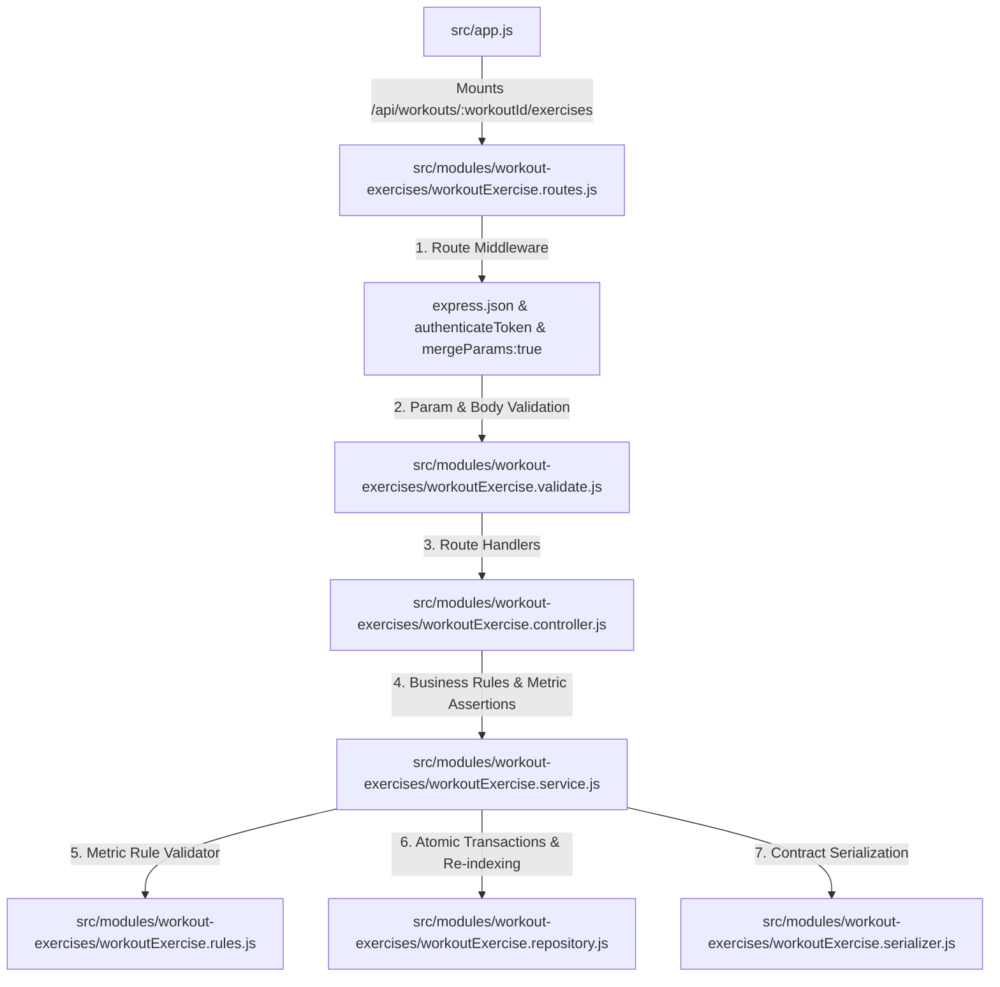
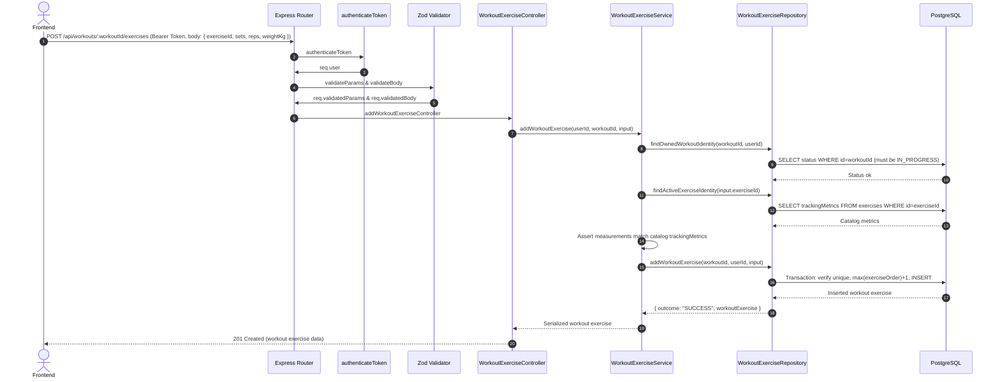
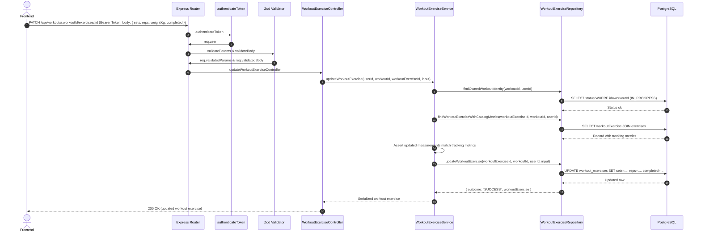
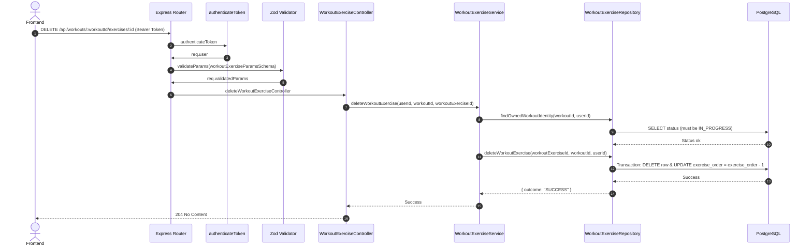

# Workout Exercises Module - Complete Architecture & Flow

This document details nested resource routing, measurement constraints against catalog tracking metrics, and exercise ordering for **Workout Exercises** (`/api/workouts/:workoutId/exercises`).

---

## 1. High-Level File Integration



---

## 2. Endpoints Overview

All routes are nested under `/api/workouts/:workoutId/exercises`:

| Method | Endpoint | Purpose | Validation | Constraints |
| :--- | :--- | :--- | :--- | :--- |
| `POST` | `/` | Add an exercise summary to active workout | `addWorkoutExerciseSchema` | Workout must be `IN_PROGRESS`, max 50 exercises, unique exercise per workout |
| `PATCH` | `/:workoutExerciseId` | Update sets, reps, load, or completion status | `updateWorkoutExerciseSchema` | Matches catalog `trackingMetrics` |
| `DELETE` | `/:workoutExerciseId` | Remove exercise from workout and re-index `exerciseOrder` | `workoutExerciseParamsSchema` | Atomic re-indexing |

---

## 3. Core Business Rules

1. **Catalog Metric Enforcement**:
   * The backend loads `exercise.trackingMetrics` from the database.
   * If an exercise tracks `["SETS", "REPS", "WEIGHT_KG"]`, the client must supply non-null values for all three fields. Extra unconfigured metrics are rejected.
2. **Exercise Ordering (`exerciseOrder`)**:
   * `exerciseOrder` is 100% server-managed.
   * Adding a new exercise assigns `max(exerciseOrder) + 1`.
   * Deleting an exercise decrements `exerciseOrder` for all subsequent exercises within a database transaction:
     ```sql
     UPDATE workout_exercises
     SET exercise_order = exercise_order - 1
     WHERE workout_id = $1 AND exercise_order > $2;
     ```
3. **Immutability of Finished Workouts**:
   * No exercise can be added, modified, or deleted once a workout is `COMPLETED` or `CANCELLED`.

---

## 4. Request Sequences & Execution Flows

### A. `POST /api/workouts/:workoutId/exercises` (Add Exercise)



### B. `PATCH /api/workouts/:workoutId/exercises/:workoutExerciseId` (Update Sets / Completed)



### C. `DELETE /api/workouts/:workoutId/exercises/:workoutExerciseId` (Delete & Re-Index Order)



