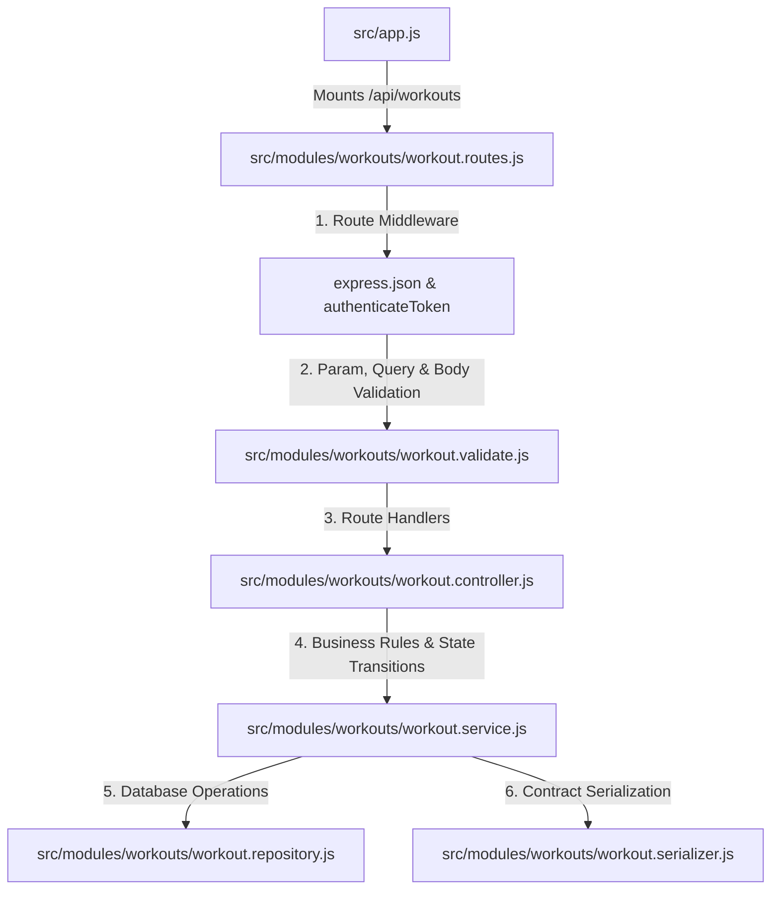
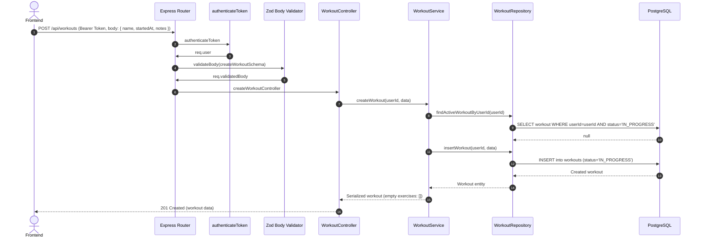
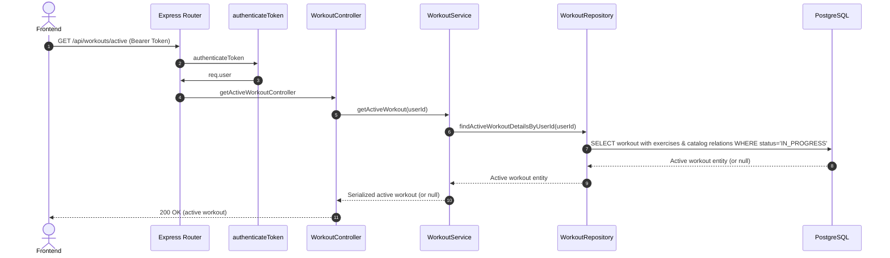
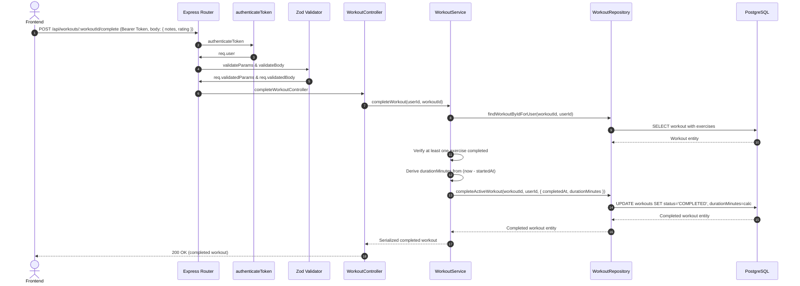
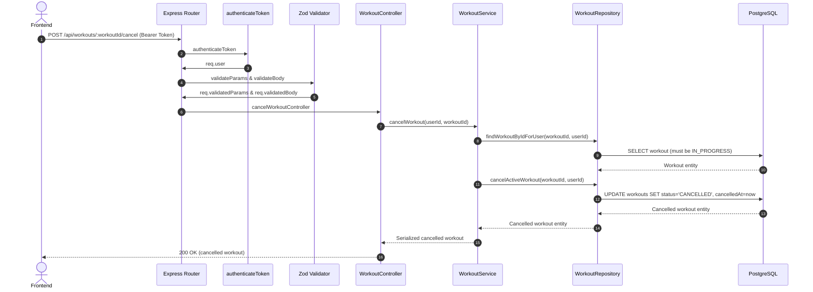

# Workouts Module - Complete Architecture & Flow

This document details the workout lifecycle, concurrency guards, server-owned duration calculations, and endpoint structure of the **Workouts Module** (`/api/workouts`).

---

## 1. High-Level File Integration



---

## 2. Endpoints Overview

| Method | Endpoint | Allowed State | Purpose | Validation |
| :--- | :--- | :--- | :--- | :--- |
| `POST` | `/api/workouts` | No active workout | Start a new in-progress workout session | `createWorkoutSchema` |
| `GET` | `/api/workouts/active` | `IN_PROGRESS` | Retrieve current active workout + exercises | None |
| `GET` | `/api/workouts/history` | `COMPLETED` | List completed workouts (paginated, date filters) | `workoutHistoryQuerySchema` |
| `GET` | `/api/workouts/:workoutId` | All | Fetch specific workout details | `workoutIdParamSchema` |
| `PATCH` | `/api/workouts/:workoutId` | `IN_PROGRESS` | Update workout name, notes, or rating | `workoutIdParamSchema` + `updateWorkoutSchema` |
| `POST` | `/api/workouts/:workoutId/complete` | `IN_PROGRESS` | Complete session (calculates duration, requires completed exercise) | `workoutIdParamSchema` + `workoutActionSchema` |
| `POST` | `/api/workouts/:workoutId/cancel` | `IN_PROGRESS` | Cancel and discard active workout | `workoutIdParamSchema` + `workoutActionSchema` |

---

## 3. Workout Lifecycle & Concurrency Guard

Workouts enforce a strict one-active-workout rule:

```text
               ┌───────────────┐
               │  IN_PROGRESS  │
               └───────┬───────┘
                       │
          ┌────────────┴────────────┐
          │                         │
   completeWorkout()          cancelWorkout()
          │                         │
          ▼                         ▼
   ┌─────────────┐           ┌─────────────┐
   │  COMPLETED  │           │  CANCELLED  │
   └─────────────┘           └─────────────┘
```

1. **Active Workout Guard**: A user cannot start a new workout if a workout with status `IN_PROGRESS` already exists. Returns `409 ACTIVE_WORKOUT_EXISTS`.
2. **Server-Owned Duration**: The client never submits elapsed time directly. On completion:
   ```javascript
   const completedAt = new Date();
   const elapsedMs = completedAt.getTime() - current.startedAt.getTime();
   const durationMinutes = Math.max(1, Math.ceil(elapsedMs / 60_000));
   ```
3. **Completion Precondition**: A workout cannot be marked completed unless at least one exercise has `completed: true`. Returns `409 WORKOUT_COMPLETION_REQUIRED`.

---

## 4. Request Sequences & Execution Flows

### A. `POST /api/workouts` (Start Workout)



### B. `GET /api/workouts/active` (Get In-Progress Workout)



### C. `POST /api/workouts/:workoutId/complete` (Complete Workout)



### D. `POST /api/workouts/:workoutId/cancel` (Cancel Workout)



