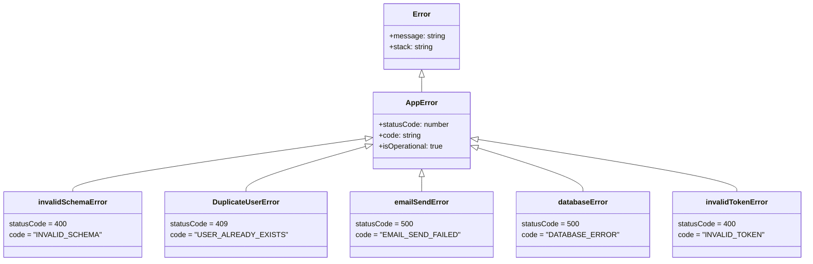
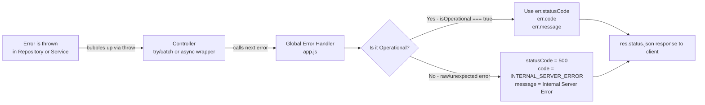

# Error Handling in Spotter Backend

This document explains how errors are created, classified, propagated, and ultimately formatted into an HTTP response. Every error in the system follows a single, consistent lifecycle.

---

## 1. The Core Concept: Operational vs Unexpected Errors

The most important distinction in our error system is the **`isOperational` flag**.

| Type | `isOperational` | Meaning | Example |
| :--- | :---: | :--- | :--- |
| **Operational** | `true` | A known, expected business failure. The client did something wrong, or a resource genuinely doesn't exist. | Invalid email format, duplicate username |
| **Unexpected** | `false` (absent) | Something we didn't plan for. A bug, a crashed service, a misconfigured environment. | A raw `TypeError`, an unknown Prisma error |

This flag is the single switch the global error handler reads to decide whether to trust the error's message, or to hide it behind a generic `"Internal Server Error"`.

---

## 2. The Error Class Hierarchy

All custom errors live in `src/middlewares/errorHandling.js` and extend a base `AppError` class.

### The Base: `AppError`

```js
export class AppError extends Error {
    constructor(message, statusCode, code) {
        super(message);
        this.statusCode = statusCode;  // The HTTP status code to send
        this.code       = code;         // A machine-readable string for the frontend
        this.isOperational = true;      // Tells the global handler: "trust this error"
        Error.captureStackTrace(this, this.constructor);
    }
}
```

> **Why `Error.captureStackTrace`?**
> When you create an error inside a constructor, the stack trace normally starts at the `AppError` constructor itself (which is useless noise). `captureStackTrace` cuts those internal frames out so you see *where in your actual code* the error was thrown.

### The Subclasses

Each subclass hard-codes the `statusCode` and `code`, so callers only need to provide a message (or not even that, in some cases).



---

## 3. The Error Lifecycle (Throw → Propagate → Respond)

An error's life has three phases: it is **thrown** somewhere deep in the stack, it **propagates** upward through the layers, and is **caught** by the global handler which formats it into a JSON response.



---

## 4. Where Each Error Is Thrown

### 4.1. `invalidSchemaError` — thrown in `validatebody.js`

This is triggered before any of your business logic runs. Zod validates the raw `req.body` and if any field fails its rules, it immediately throws this error.

```js
// src/middlewares/validatebody.js
if (!result.success) {
  const errorMessages = result.error.issues
    .map((issue) => issue.message)
    .join(", ");
  throw new invalidSchemaError(errorMessages);
  // → 400 INVALID_SCHEMA "Email is invalid, Password must be at least 8 chars"
}
```

**Why here?** To stop bad data as early as possible. The repository and service layers never even run. No database query is wasted.

---

### 4.2. `DuplicateUserError` — thrown in `user.repository.js`

When Prisma tries to insert a new user and the email or username already exists in the database, Postgres rejects the insert and Prisma surfaces it as error code `P2002`. We catch that specific code and convert it into a clean error.

```js
// src/modules/auth/user.repository.js
} catch (error) {
  if (error.code === "P2002") {
    let field = "email or username";
    if (Array.isArray(error.meta?.target)) {
      field = error.meta.target[0];
    } else if (typeof error.meta?.target === "string") {
      field = error.meta.target;
    }
    throw new DuplicateUserError(field);
    // → 409 USER_ALREADY_EXISTS "A user with that email already exists."
  }
  // ...
}
```

**Why the `Array.isArray` check?** Prisma's `error.meta.target` format is not consistent across all database driver versions. Sometimes it's an array `["email"]`, sometimes a plain string `"email"`. The defensive check handles both safely instead of crashing with an `undefined` error.

---

### 4.3. `databaseError` — thrown in `user.repository.js`

Any Prisma error that is **not** a `P2002` falls through to the generic catch and becomes a `databaseError`. This could be a network timeout, a corrupted row, or any other unexpected database failure.

```js
// src/modules/auth/user.repository.js
// Re-throw other unexpected database errors
throw new databaseError("Database error occurred while creating user.");
// → 500 DATABASE_ERROR "Database error occurred while creating user."
```

**Why do we still use a custom class here and not let the raw Prisma error through?** Because even though it's an unexpected error, we want to control what message the client sees. The internal Prisma error message might contain schema details or database internals we don't want to expose.

---

### 4.4. `emailSendError` — thrown in `auth.service.js`

After the user is successfully saved, we try to send the verification email. If Nodemailer fails (wrong credentials, Gmail is down, network issue), we catch it and throw this error.

```js
// src/modules/auth/auth.service.js
try {
    const info = await transporter.sendMail({ ... });
} catch (error) {
    console.error("❌ Failed to send verification email:", error);
    throw new emailSendError("Failed to send verification email. Please try again later.");
    // → 500 EMAIL_SEND_FAILED "Failed to send verification email..."
}
```

> [!IMPORTANT]
> Notice that the user **is already created in the database** before this error is thrown. This means if you get a `500 EMAIL_SEND_FAILED`, the account exists but the verification email was never delivered. A production-grade solution would use a job queue (e.g., BullMQ) to retry the email without blocking the signup response, or implement a "Resend verification email" endpoint.

---

### 4.5. `invalidTokenError` — thrown in `auth.service.js`

During email verification, the repository does an `updateMany` looking for the token, checking it isn't expired, and checking the account isn't already verified. If `result.count === 0`, it means **one of those three conditions failed** (wrong token, expired token, or already verified), and we throw this error.

```js
// src/modules/auth/auth.service.js
if (updatedCount === 0) {
    throw new invalidTokenError("Verification link is invalid or has expired.");
    // → 400 INVALID_TOKEN "Verification link is invalid or has expired."
}
```

**Why not tell the user which specific condition failed?** Security. If we said "that token doesn't exist," an attacker could probe tokens until they find a valid one (and know it's valid). Keeping the message vague covers all cases without leaking information.

---

## 5. The Global Error Handler (`app.js`)

This is the single place in the entire application that converts an error object into an HTTP response. It is registered **after** all routes so it catches everything.

```js
// src/app.js
app.use((err, req, res, next) => {
  // Edge case: headers already sent (rare, but must be handled)
  if (res.headersSent) {
    return next(err);
  }

  // Always log to console — developers need to see all errors
  console.error(err);

  // Detect Express-internal errors (from express.json() middleware)
  const invalidJson = err.type === "entity.parse.failed";
  const tooLarge    = err.type === "entity.too.large";
  
  // The isOperational flag decides everything
  const isOperational = err.isOperational === true;

  const statusCode = invalidJson  ? 400
                   : tooLarge     ? 413
                   : isOperational ? err.statusCode
                   :                 500;

  const code       = invalidJson  ? "INVALID_JSON"
                   : tooLarge     ? "ENTITY_TOO_LARGE"
                   : isOperational ? err.code
                   :                 "INTERNAL_SERVER_ERROR";

  const message    = invalidJson  ? "Request body contains invalid JSON."
                   : tooLarge     ? "Request body is too large."
                   : isOperational ? err.message
                   :                 "Internal Server Error"; // hides internal details

  return res.status(statusCode).json({ error: message, code });
});
```

### How the handler deals with the two Express-internal errors

`express.json()` is not our code, so it throws its own raw errors. The handler catches and classifies two of them by their `err.type` property:

| `err.type` | Cause | Response |
| :--- | :--- | :--- |
| `entity.parse.failed` | Client sent malformed JSON (e.g., `{name: "no quotes"}`) | `400 INVALID_JSON` |
| `entity.too.large` | Body exceeds the size limit | `413 ENTITY_TOO_LARGE` |

### The `headersSent` guard

This is a rare but important edge case. If a response has already started streaming (headers sent, but body not yet complete) and an error occurs, calling `res.json()` would throw `ERR_HTTP_HEADERS_SENT` and crash. The guard detects this and passes the error to Node's default handler instead.

---

## 6. Full Error Map

| Thrown By | Error Class | Status | Code | Cause |
| :--- | :--- | :---: | :--- | :--- |
| `validatebody.js` | `invalidSchemaError` | 400 | `INVALID_SCHEMA` | Zod validation fails |
| `express.json()` | (Raw Express error) | 400 | `INVALID_JSON` | Malformed JSON body |
| `express.json()` | (Raw Express error) | 413 | `ENTITY_TOO_LARGE` | Body too big |
| `rateLimiter.js` | (express-rate-limit) | 429 | — | IP exceeded request limit |
| `user.repository.js` | `DuplicateUserError` | 409 | `USER_ALREADY_EXISTS` | Email/username taken |
| `user.repository.js` | `databaseError` | 500 | `DATABASE_ERROR` | Unknown Prisma error |
| `auth.service.js` | `emailSendError` | 500 | `EMAIL_SEND_FAILED` | Nodemailer/Gmail failure |
| `auth.service.js` | `invalidTokenError` | 400 | `INVALID_TOKEN` | Token wrong, expired, or already used |
| Anywhere | (Raw JS error) | 500 | `INTERNAL_SERVER_ERROR` | A bug / unhandled exception |
